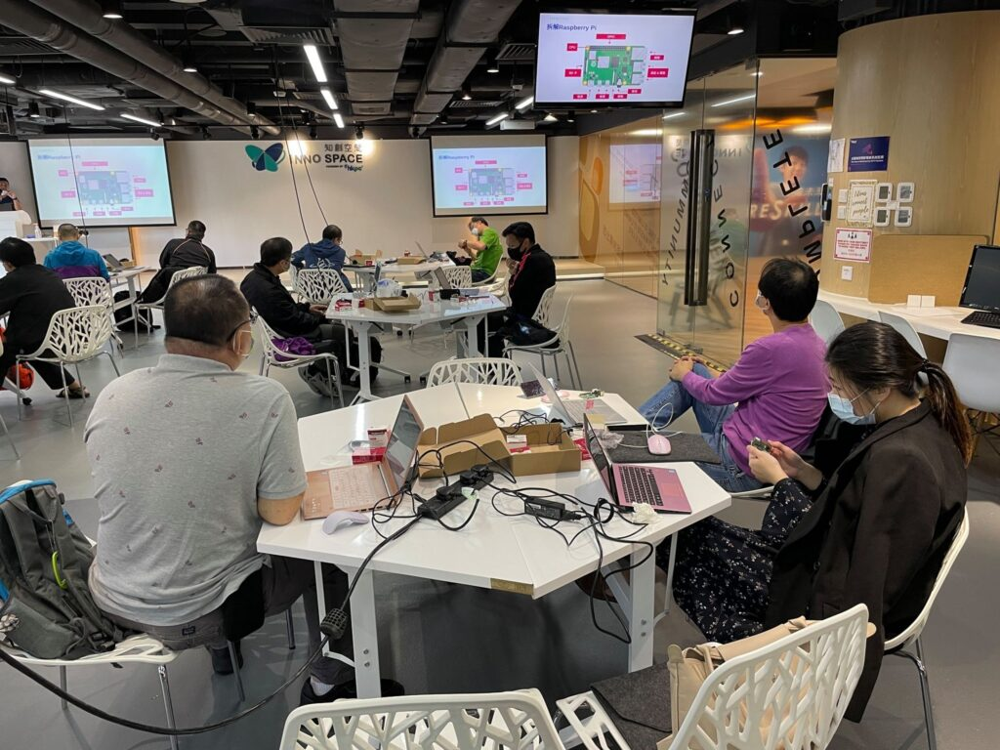
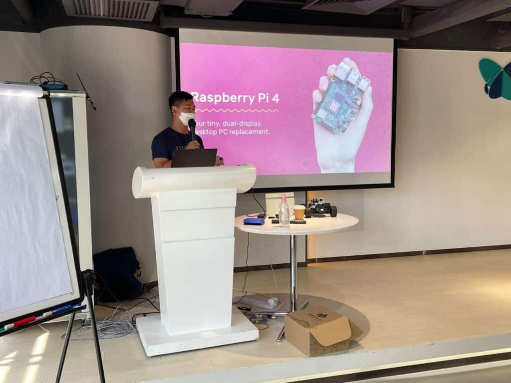
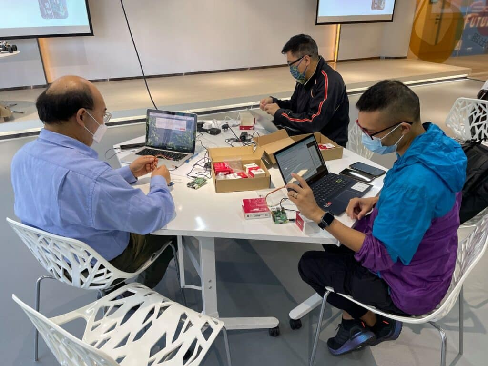

---
title: "點樣用 Raspberry Pi 係校內教授 Python？"
publishDate: 2021-11-13
description: "探討如何在校內使用Raspberry Pi教授Python編程，提供實用的教學方法和課程設計建議，幫助學生掌握基礎編程概念。"
featuredImage: "../../assets/images/news/2021-11-13-點樣用raspberry-pi-係校內教授-python/image1.jpeg"
SEOImage: "../../assets/images/news/2021-11-13-點樣用raspberry-pi-係校內教授-python/image1.jpeg"
category: "文章"
tags: []
author: "jacksonchan"
---

我哋同 15 位老師分享如何利用 Raspberry Pi 在校內教授 Python。每位老師都親身嘗試係 Jupyter Lab 打 command 同寫 Python ！雖然當中都遇到唔少問題，但大家都本著解決問題既精神一步步認識學習 Raspberry Pi ，亦有老師籌劃緊點樣將 Raspberry Pi 落地係課堂入面應用！希望喺之後既活動能見到大家，多謝大家支持！

而我哋都有適合中學生嘅Raspberry Pi 入門課程，如果想知多啲，請按：

https://10botics.com/school-courses/raspberry-pi/

