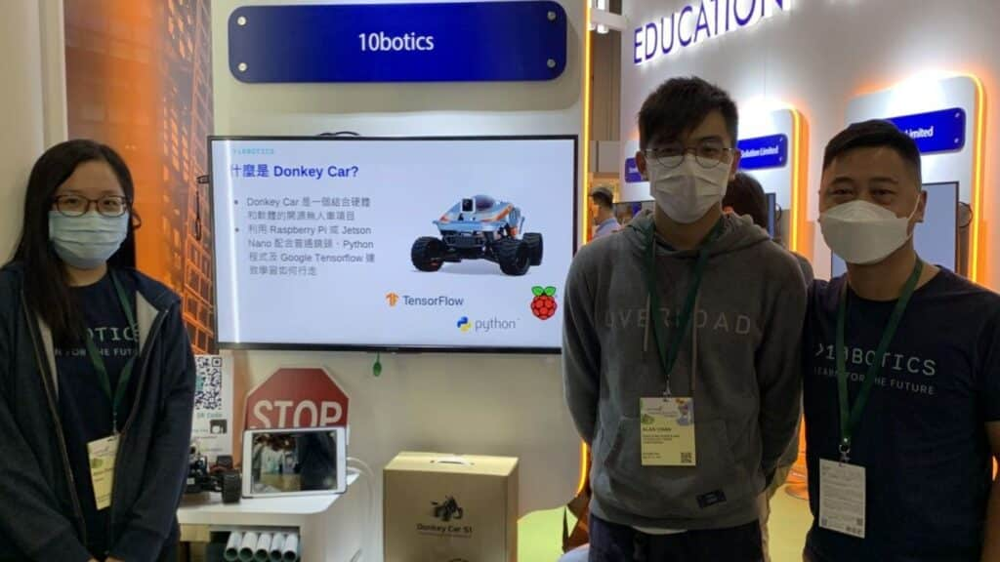
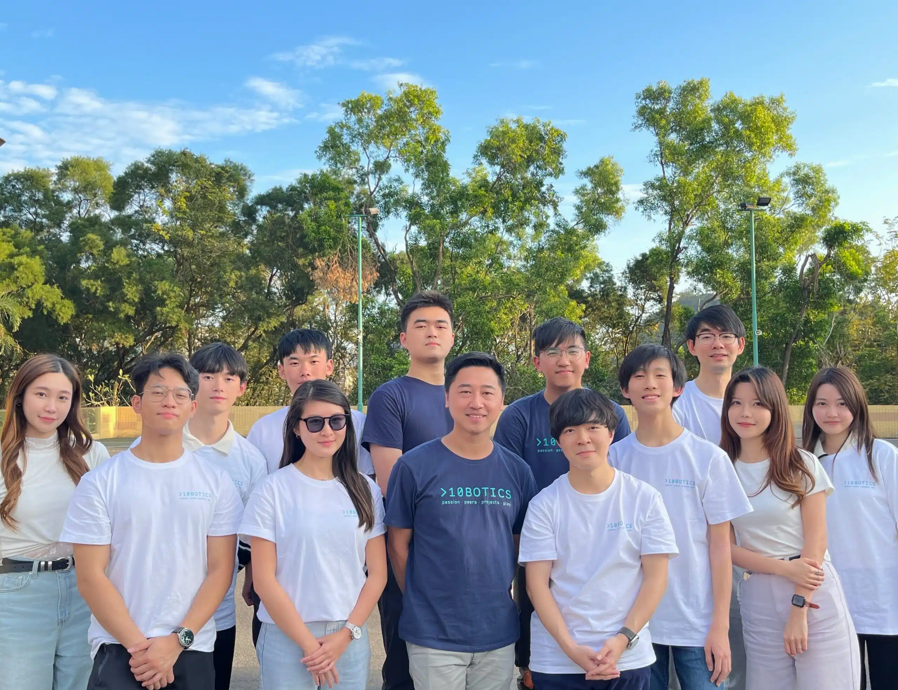

---
title: "Donkey Car x 學與教博覽 2021"
publishDate: 2021-12-09
description: "記錄Donkey Car在學與教博覽2021中的展示，展示AI自駕車技術在教育領域的應用和創新教學方法。"
featuredImage: "../../assets/images/news/2021-12-09-donkey-car-x學與教博覽2021/image1.png"
SEOImage: "../../assets/images/news/2021-12-09-donkey-car-x學與教博覽2021/image1.png"
category: "文章"
tags: []
author: "jacksonchan"
---

## 好多老師都聽過或者知道咩喺Donkey Car，但你有無實際接觸過呢？

我哋 10Botics 於今年12月8、9日喺「學與教博覽2021」舉辦一連兩日的活動，同各位校長及老師們展示 Donkey Car 無人車﹑以及分享 AI 如何在學校裏實行及推廣。更加要多謝[聖公會李福慶中學](https://www.skhlfh.edu.hk/)陳俊銘老師邀請我地一齊分享「在中學透過智能車有效實踐人工智能教育的範例」，等我地向同工分享用無人車學 AI 既樂趣。我地希望日後學生可以繼續在玩樂中學習，發掘到自己既潛能﹑盡顯所長！

