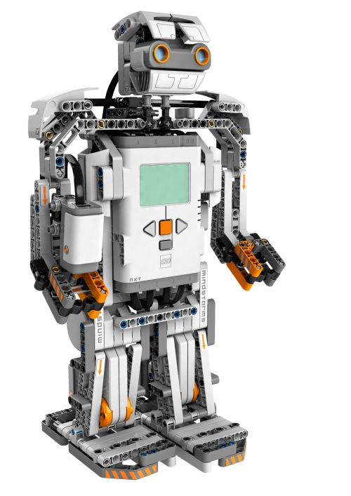
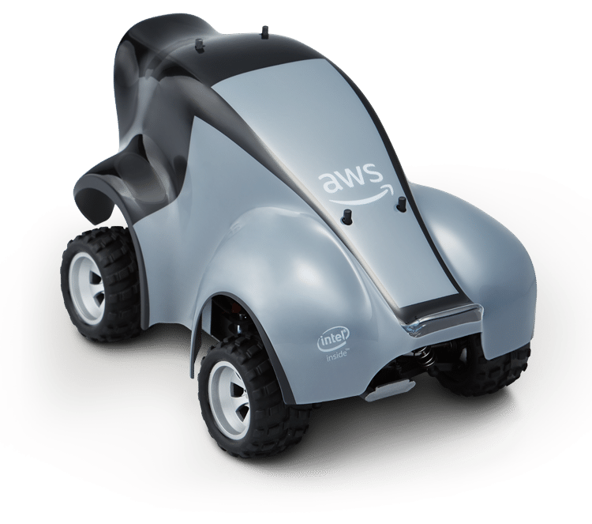
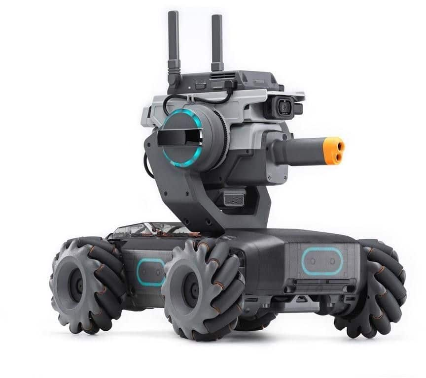
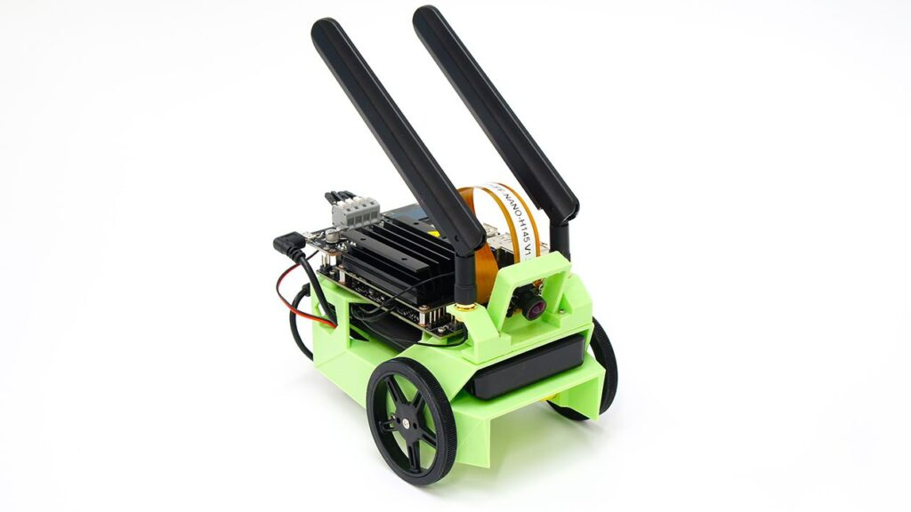
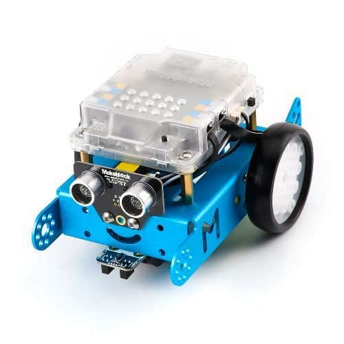
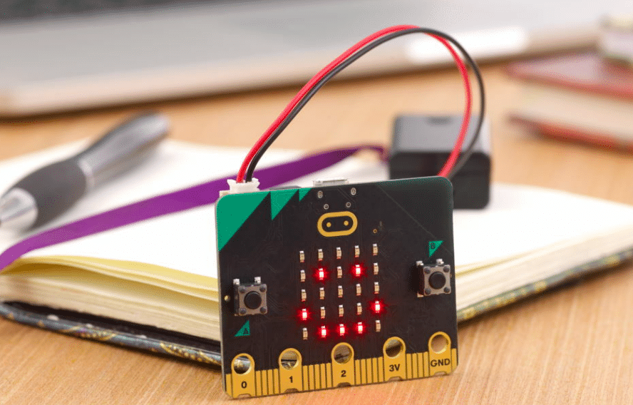
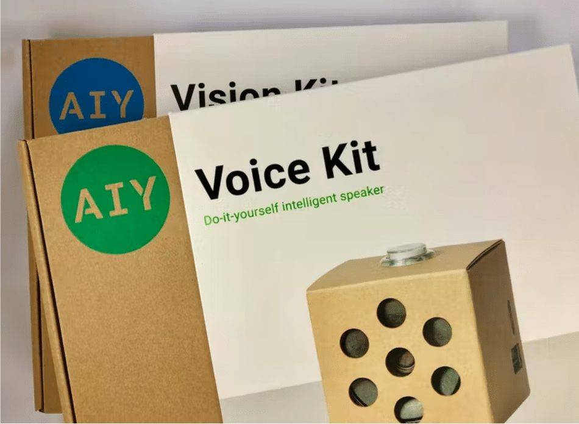

---
title: "中小學 AI Lab 必備的 9 個 AI 硬件"
publishDate: 2022-04-22
description: "探討中小學AI Lab必備的9個AI硬件設備，包括Lego Mindstorms、DeepRacer、DJI Robomaster等，分析各設備的學習難度、硬件質素、AI功能及適用人群。"
featuredImage: "../../assets/images/news/2022-04-22-中小學-ai-lab-必備的-9-個-ai-硬件/image1.png"
SEOImage: "../../assets/images/news/2022-04-22-中小學-ai-lab-必備的-9-個-ai-硬件/image1.png"
category: "文章"
tags: []
author: "jacksonchan"
---

人工智能教育是世界的大趨勢。先進國家如北美及歐洲許多教育單位正在推動小學 1年級到高中3年級的人工智能學習。香港近幾年也投放大量資源，很多中小學也會在學校成立 AI Lab ，集中讓同學學習。10Botics 訪問不同的老師，發現以下 9個 AI 硬件最多老師使用

## 9. Lego Mindstorms NXT

NXT 是 Lego 的學習機械人。使用 Lego 積木來製作，結合超聲波，聲音，光線和触摸傳感器，可以驅使機械人做不同的動作。NXT 更支緩藍牙功能，同學可以從手機上命令機器人。NXT 使用 Lego 自行研發的程式進行編碼，對初學編碼的用戶非常容易。但官方並不支緩現在主流的 Python 和 Scratch，而且並不提供 AI 學習功能。

學習容易度：5/5

硬件質素：4/5

軟件支緩：2/5

編碼語言: EV3 Mindstorms

AI 學習功能：沒有

可以進行編碼： 可以

學習資源：4/5

自行組裝：需要

官方課程：有

延展性：2/5

價錢：1/5

適合人士：小學生或以上，但對有經驗的用戶略有不足

特點：NXT 並不支緩現在主流的 Python 和 Scratch，而且並不提供 AI 學習功能。如果想創作更複雜的人工智能項目，NXT 略為不足。

總分：4/10

## 8. DeepRacer

AWS 的 DeepRacer 是專為有經驗的用戶而設計的自駕車。DeepRacer 配備先進的 AI 強化學習技術及專業的硬件。與其他機器學習方法相比，它採用非常不同的方法來訓練模型，可以學習非常複雜的行為。強化學習也應用在日常生活很多程式上，著名的 Alpha Go 也是使用強化學習訓練的。

學習容易度：2/5

硬件質素：4/5

軟件支緩：3/5

編碼語言：Python

AI 學習功能：有

可以進行編碼： 可以

學習資源：2/5

自行組裝：需要

官方課程：沒有

延展性：2/5

價錢：2/5

適合人士：中學生或以上

特點：DeepRacer 是唯一配備雙鏡頭及 Lidar 光學雷達的自駕車。而 AI 強化功能也非常先進。AWS 也會定期舉行國際比賽。但作為教育用途的話，同學可能會較難入手。

總分：4/10

## 7. DJI Robomaster

RoboMaster S1 是著名的 DJI 公司的機器人。S1 的外型討好，用戶可以通過遊戲進行學習。S1 具有六個可編程的 AI 模塊，支持 Scratch 和 Python 編程。同學還可以對 S1 其他功能進行編程，例如照明效果，雲台運動等。唯 S1 的價錢比較昂貴。

學習容易度：4/5

硬件質素：4/5

軟件支緩：5/5

編碼語言: Scratch/ Python

AI 學習功能：有

可以進行編碼： 可以

學習資源：3/5

自行組裝：不需要

官方課程：沒有

延展性：2/5

價錢：1/5

適合人士：小學生或以上

特點：S1 的外型非常討好，對於用戶來說會是一個非常不錯的學習工具。但價錢比較昂貴。

總分：5/10

## 6. Jetbot

由 Nvidia 推出的 Jetbot 為有興趣學習 AI的同學提供所需的硬件。Jetbot NANO 可以進行面部識別，對象跟踪，自動路線跟踪。Jetbot 自駕車是一個開源（Open sourced）項目，所以自駕車的所有配件都需要自行組裝。Jetbot 可以直接使用 Python 進行編碼，但用戶需要自行安裝 Jetbot ROS，對於沒有經驗的用戶可能會較難完成。

由於 Jetbot 是開源項目，網上已有大量的資源可作參考，但官方沒有完整的課程提供。

學習容易度：2/5

硬件質素：3/5

軟件支緩：5/5

編碼語言: Python

AI 學習功能：有

可以進行編碼：可以

學習資源：3/5

自行組裝：需要

官方課程：沒有

延展性：4/5

價錢：3/5

適合人士：中學生或以上

特點：Nvidia 是專門生產 AI 晶片的公司。Jetbot 已預載 AI 學習硬件，對於有經驗的用戶來說非常方便，但 Nvidia 並不提供完整的自駕車，用戶需要自行組裝。

總分：6/10

## 5. mBot

mBot 是專為教育而設計的機器人，可以讓用戶進行一些簡單的 STEM 項目，例如避開障外物和自動路線跟踪。mBot 設計較為簡單，特別適合小學同學們。mBot 並沒有提供 AI學習功能，如果用戶想學習人工智能的基礎，mBot 可能有點不足。mBot 可以使用 Python 或 Scratch 進行編碼。

mBot 有完整的課程提供，同學可以按照課程學習。

學習容易度：4/5

硬件質素：2/5

軟件支緩：5/5

編碼語言: Scratch/ Python

AI 學習功能：沒有

可以進行編碼： 可以

學習資源：4/5

自行組裝：不需要

官方課程：有

延展性：2/5

價錢：3/5

適合人士：小學生或以上

特點：對於初學者來說會是一個不錯的選擇，但 mBot 不能進行改裝或配備不同的組件，用途較為單一。

總分：6/10

## 4. Microbit

Microbit 是專為初學者而設計的袖珍計算機。Microbit 上配有 25 顆 LED，初學者可以學習使用編碼啟動，例用設計表情符號並創建剪刀石頭布的遊戲。有經驗的同學可以使用其他傳感器和無線功能來製作自已的項目。Microbit 並不提供 AI 學習功能，對有經驗及人工智能有興趣的用戶可能有點不足。

學習容易度：4/5

硬件質素：4/5

軟件支緩：5/5

編碼語言: Scratch/ Python

AI 學習功能：沒有

可以進行編碼： 可以

學習資源：4/5

自行組裝：需要

官方課程：沒有

延展性：2/5

價錢：5/5

適合人士：小學生或以上，但對有經驗的用戶略有不足

特點：Microbit 的設計比較簡單，只適合初學人者。優點是價錢較為大眾化。

總分：6/10

## 3. Google AIY Projects

Google AIY 是 Google 旗下的一個教育硬件。Google AIY 硬件而預先搭載 Google 的 TensorFlow AI 處理器，同學可以使用硬件製作很多有趣的 AI 項目，例如識別情緒和常見物體，追蹤面孔等，連接到 Google Assistance 更可以作語音辦認。同學可以發揮創意，組裝自已的 AI 項目。

學習容易度：3/5

硬件質素：4/5

軟件支緩：5/5

編碼語言: Scratch/ Python

AI 學習功能：有

可以進行編碼： 可以

學習資源：4/5

自行組裝：需要

官方課程：沒有

延展性：4/5

價錢：5/5

適合人士：中學生或以上

特點：Google 出品的教育硬件，AIY Projects 可對應 Google 的產品。而且硬件的延展性及 AI 學習功能非常高，可滿足不同用戶的需要。

總分：7/10

## 2. Sphero

Sphero 是一個非常小巧的學習機械人。初學者可以通過流動裝置上安裝 Sphero app 控制機器人。Sphero 更支緩 Python/ Scratch，有經驗的同學可以進行更複雜的編碼。Sphero 是在北美比較有規模的公司，網站內提供大量的教學課程，方便老師或同學自行學習。可惜的是，Sphero 並沒有 AI 學習功能。

學習容易度：5/5

硬件質素：3/5

軟件支緩：4/5

編碼語言: Scratch/ Python

AI 學習功能：沒有

可以進行編碼： 可以

學習資源：5/5

自行組裝：不需要

官方課程：有

延展性：2/5

價錢：4/5

適合人士：小學生或以上

特點：Sphero 提供完整的官方課程，老師和同學可以自行學習。而且 Sphero 可以使用官方的 App 來控制，對於初學人士非常方便。

總分：7/10

## 1. Donkey Car

由 10Botics 推出的 Donkey Car是很多歐美大學的 AI Lab 都在使用。Donkey Car 預載使用 AI 學習技術，可以按照目標進行深度學習。Donkey Car 支緩 10Botics 自行研發的 App，初學同學可以在流動裝置上進行即時訓練，有經驗的同學可以進行更複雜的編碼。10Botics 更提供完整的學習資源及課程，方便老師或同學自行學習。由於 Donkey Car 採用 Raspberry，所以同學可以進行改裝或配備不同的組件。

學習容易度：4/5硬件質素：4/5軟件支緩：4/5編碼語言：Python AI 學習功能：有可以進行編碼： 可以學習資源：5/5自行組裝：不需要官方課程：有延展性：4/5價錢：4/5適合人士：小學生或以上特點：Donkey Car 已預載 AI 學習功能，用戶無需電腦，便可直接在 10Botics 的 App 中在進行 AI 模型訓練。而 Donkey Car 採用 Raspberry，用戶可以對此進行改裝，創作不同的項目。10Botics 更提供完整課程，方便學習。

總分：8/10
