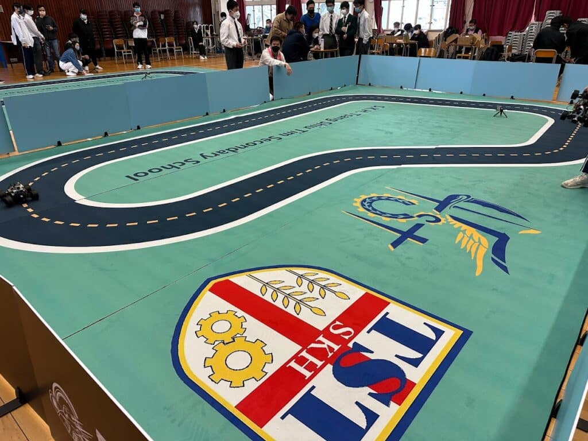

---
title: "香港校際 AI 方程式 2022 第四站 - 聖公會曾肇添中學"
publishDate: 2023-03-03
description: "記錄香港校際AI方程式2022第四站比賽在聖公會曾肇添中學舉行的精彩時刻，展示參賽隊伍的創新AI技術應用和競技表現。"
featuredImage: "../../assets/images/news/2023-03-03-香港校際-ai-方程式-2022-第四站-聖公會曾肇添中學/image1.jpg"
SEOImage: "../../assets/images/news/2023-03-03-香港校際-ai-方程式-2022-第四站-聖公會曾肇添中學/image1.jpg"
category: "文章"
tags: []
author: "jacksonchan"
---

話咁快已經黎到共七站賽事嘅中段，喺上星期六(2月25日)，FormulaAI 第四站之賽事於[聖公會曾肇添中學](https://www.skhtst.edu.hk/)順利完成

是次賽事超過十間學校參加，同學們施展渾身解數，務求突破自己於前站賽事嘅紀錄，並在眾多隊伍中突圍而出。

再次恭喜各位得獎同學! 第五站賽事將於3月18日於佐敦谷公園遙控模型賽車場進行。我地兩星期後佐敦谷公園見!

## 更多活動相片

[embed-google-photos-album link="https://photos.app.goo.gl/PDZeyrZrTjn4JnNV9"]
