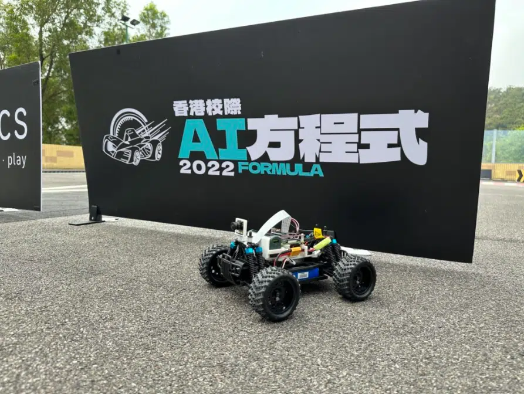

---
title: "香港校際 AI 方程式 2022 第五站 - 佐敦谷賽車場"
publishDate: 2023-03-20
description: "記錄香港校際AI方程式2022第五站比賽在佐敦谷賽車場舉行的精彩時刻，展示參賽隊伍的創新AI技術應用和競技表現。"
featuredImage: "../../assets/images/news/2023-03-20-香港校際-ai-方程式-2022-第五站-佐敦谷賽車場/image1.png"
SEOImage: "../../assets/images/news/2023-03-20-香港校際-ai-方程式-2022-第五站-佐敦谷賽車場/image1.png"
category: "文章"
tags: []
author: "jacksonchan"
---

有賴於各位老師及同學嘅積極參與和踴躍支持，喺上星期六 (3月18日)，第五站 Formula AI 於佐敦谷公園 小型遙控模型車場之賽事完滿結束!

今次係各位同學首次於戶外場地進行比賽，面對偌大嘅環境及陌生嘅賽道設計，簡直係全新嘅挑戰。幸好最後各隊伍順利解決難題，參賽者都樂在其中。

共七站嘅Formula AI賽事話咁快就黎到最後兩站，復活節假期過後，第六站嘅賽事將會於[聖類斯中學](https://www.stlouis.edu.hk/)舉行。Stay tuned...

## 更多活動相片

[embed-google-photos-album link="https://photos.app.goo.gl/6SuuEGA6y4kET7DLA"]
