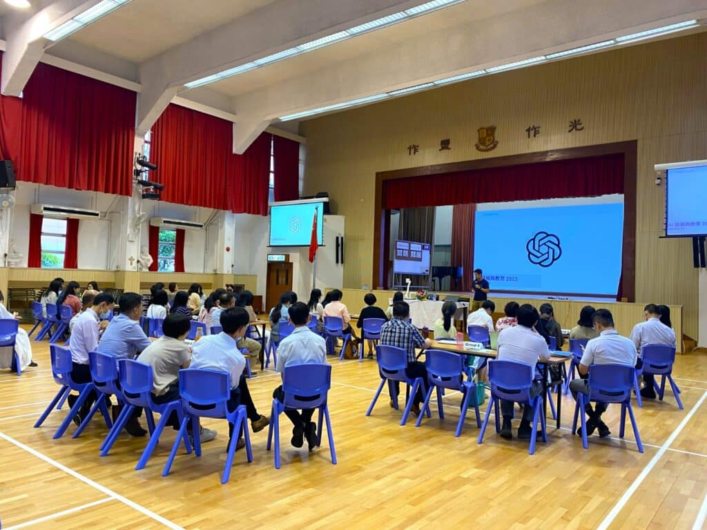

人工智能的大時代已經來臨，作為老師，應如何運用ChatGPT以協助日常教學工作以提升教學質素，並提升學生自學能力？

馬錦明慈善基金馬可賓紀念中學的老師於昨天的教師培訓日中就任教科目分成十組，就相關科目內容與ChatGPT對話，並進行分享。起初有不少老師表示不太熟悉如何與ChatGPT對話，也不太清楚該如何撰寫適當的指令。另外，有使用對話機器人經驗的老師對ChatGPT所撰寫的Rubric有正面反饋，經過一番指導及實際操作後，老師們認為此能夠支援他們評分及處理重複性較高的工作，例如撰寫範文。

我們希望能讓ChatGPT成為我們日常教學工作的有力助手，為教師們帶來更多便利和效率。期待大家能夠共同學習、分享經驗，讓教學工作更上一層樓👏

## 更多活動相片

[embed-google-photos-album link="https://photos.app.goo.gl/1FHjiCvVkf1d8baw7"]
