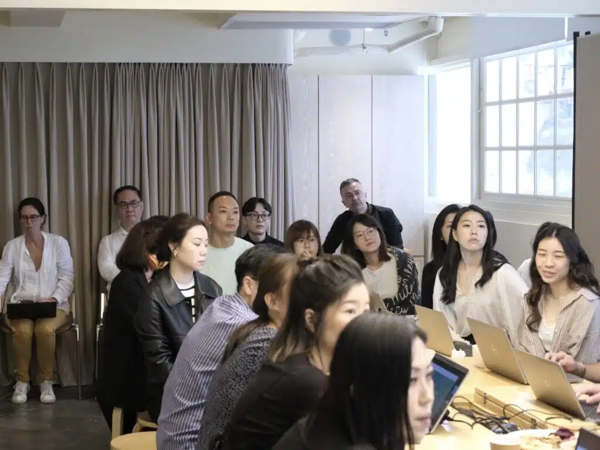

作為於學界活躍的STEM教育機構，平時教日校老師、中小學生就教得多，但其實我哋都有同好多企業合作進行人工智能工作坊㗎！究竟在職場中，應如何以AI人工智能完成繪圖、文字、對話時等工作，以提升工作效率呢？

早前10Botics有幸獲邀到AESOP進行人工智能工作坊，這次工作坊吸引了來自世界各地的AESOP職員的熱烈參與。是次工作坊的重點之一是AI繪圖。AESOP的員工們學習了如何使用AI繪圖工具的功能和參數，創造出不同的主題和風格的圖像，以應用到日常工作中

此外，他們還學習了如何運用聊天機械人來提供自動回覆和查詢的功能。這使他們能夠更有效地回答客人的問題，提供相關的資訊，並提供個性化的建議，節省了時間和人力資源，更提高了客戶服務的效率。🙌

我們期待日後有機會為更多企業介紹人工智能的最新發展，以及探索人工智能在不同領域的應用，讓各行各業的人士皆能在創科路上不斷探索，為未來的世界帶來更多驚喜和啟發。👣

## 更多活動相片

[embed-google-photos-album link="https://photos.app.goo.gl/VioFv633o8dgNeQw9"]