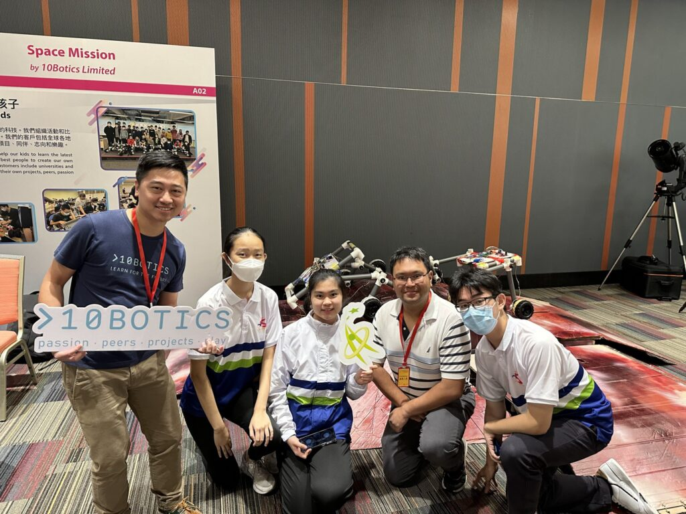

---
title: "香港資優教育學苑 15 週年慶典"
publishDate: 2023-07-28
description: "記錄香港資優教育學苑15週年慶典的精彩時刻，展示資優教育發展成果和未來展望。"
featuredImage: "../../assets/images/news/2023-07-28-香港資優教育學苑15週年慶典/image1.jpg"
SEOImage: "../../assets/images/news/2023-07-28-香港資優教育學苑15週年慶典/image1.jpg"
category: "文章"
tags: []
author: "jacksonchan"
---

作為香港資優教育學苑(HKAGE)的課程供應商，10Botics上星期有幸應邀參加了「HKAGE 15週年慶典」。在過去幾個月的課程中，學生們經歷了製作、編程和駕駛等階段，創造出屬於自己的火星車。這些作品在慶典中展示，成為了全場的焦點，教育局常任秘書長 李美嫦女士亦有到訪觀賞學生作品

課程的設計要求學生在過程中自主探索，並尋求解決方案。我們希望透過一連串的課程和工作坊，為學生提供更多實踐經驗，以培養他們的創意和邏輯思維、激發對科技的熱情，為香港的未來培養更多優秀的工程師人才。

## 更多活動相片

[embed-google-photos-album link="https://photos.app.goo.gl/KrvpFtqCEfYinXKy9"]
