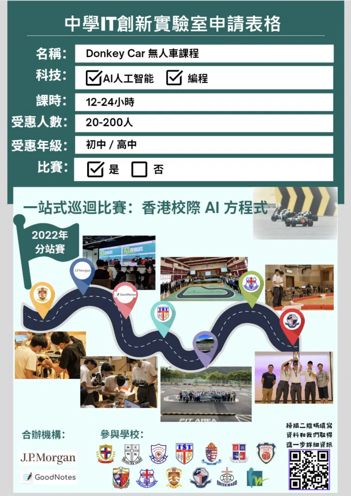
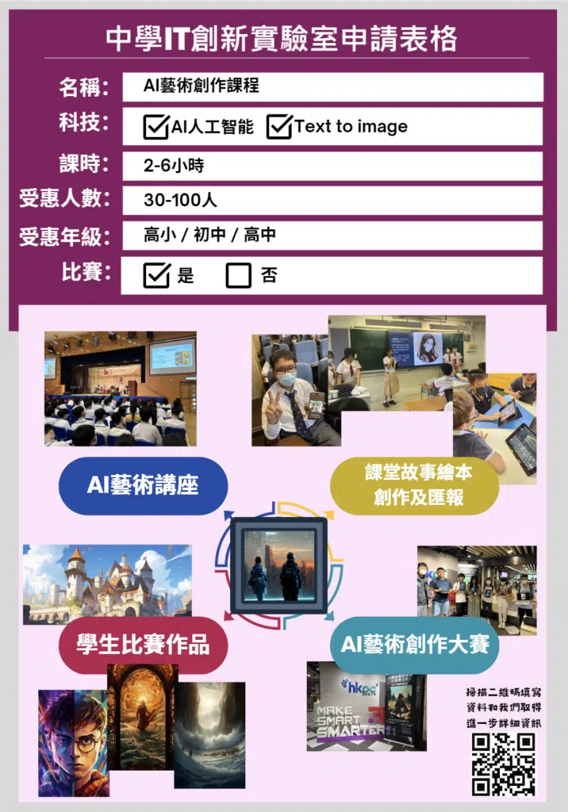
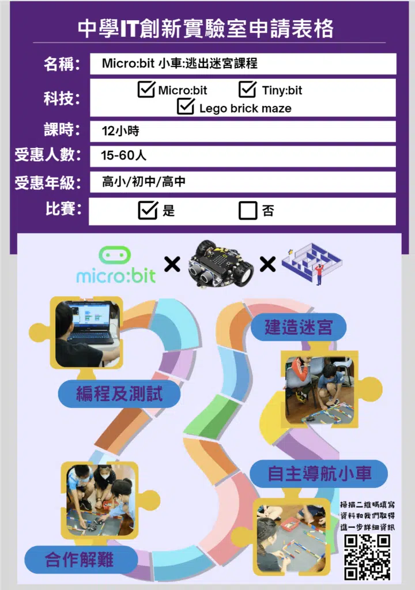
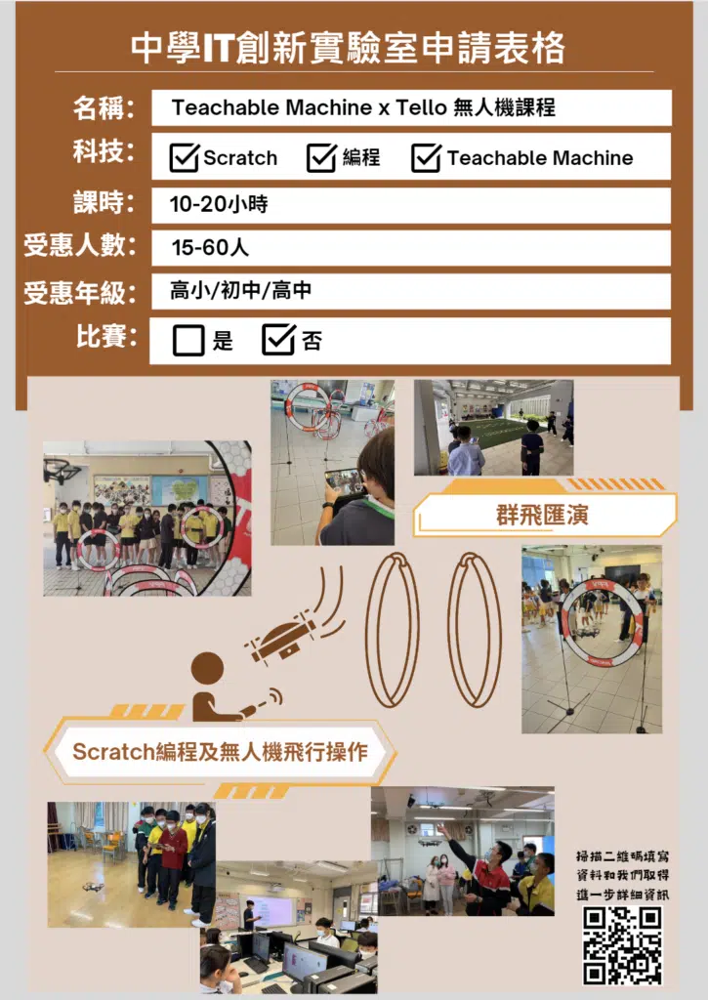
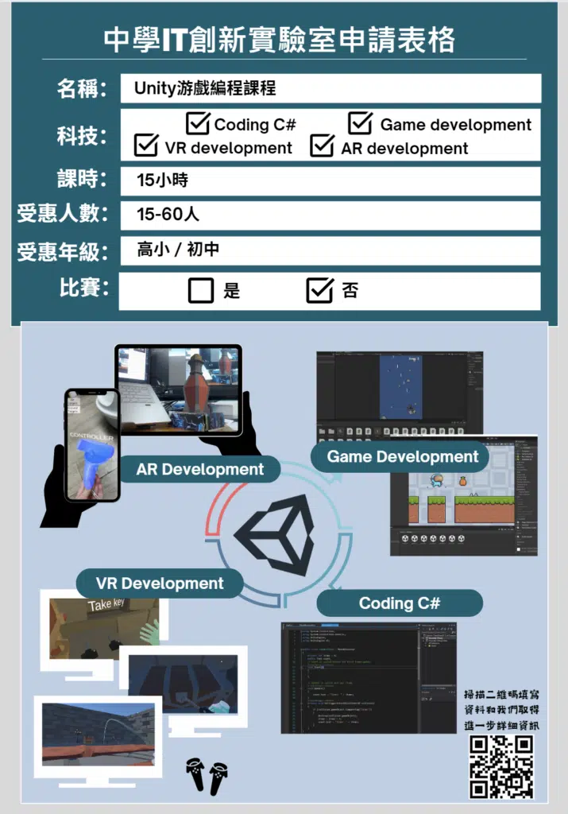
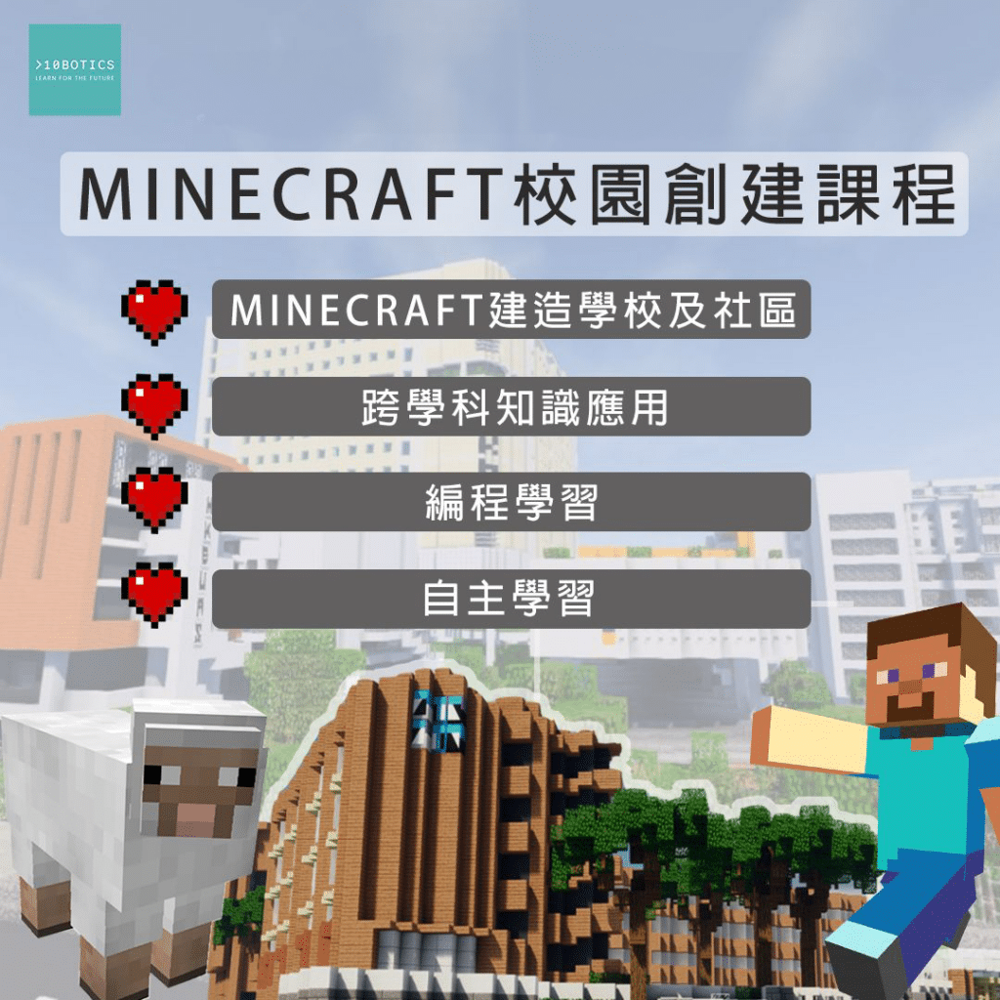

## IT創新實驗室計劃
資科辦在現行的「中學資訊科技增潤計劃」下推行「中學IT創新實驗室」計劃，在新一輪的2023/24至2025/26這3個學年中，向公帑資助的中學每所提供最高 100 萬元的資助，以提升校內資訊科技設備和設施，以及舉辦與資訊科技相關的課外活動，加深同學對嶄新資訊科技的認識。

## 計劃資助範疇
### IT設備和設施
-採購或租⽤硬件、軟件及服務器等服務
-光纖和寬頻服務
-雲端儲存服務

### IT相關課程
-人工智能課程-流動應用程式編程班-無人車競賽-無人機編程

### 其他
-活動營運開支（例如為支援學習而設的維修保養，專業服務，外聘導師）-行政費用（會計和審計服務）

### IT相關課外活動
-參觀香港的跨國公司和本地初創企業
-舉辦或參與本地和非本地比賽

## 計劃流程
### 出標書
### 收到批核結果
### 遞交申請表
### 提交年度報告
### 開展相關IT課程和活動
## 讓遞交申請變得更簡單快捷
## 申請表格範本
- 提供簡單易明的計劃表格範本進行參考，讓申請更加不易出錯而成功獲取批核。

## 制定教育撥款方案​
- 可協助學校準備IT創新實驗室申請表格和申請程序，並幫助構思一站式計劃幫助學校活用款項舉辦各類STEM活動。

## 協助學校解決申請上的問題
- 瞭解和迎合學校不同需要 （例如配合學校解決有關添置設備上的疑慮以適合IT相關活動）

## 可靠的導師和團隊
## 資歷全面的STEM導師
- 導師能夠應付不同STEM Day活動和恆常課程需要，不論是人數較多的禮堂講座，還是人數較少的班房式課堂。讓老師無後顧之憂。

## 經驗豐富的STEM團隊
- 在出標書階段，我們先後協助每間學校制定適合的課時，並協助配搭不同的STEM課程和課外活動組合供學校選擇，確保配合學校的進度和時間。

 - 對於年度報告的遞交經驗豐富，瞭解報告所需要求，我們能夠協助學校並提供所需的的資料。

## 多元化課程

以Mincraft校園創建課程爲例，該課程希望透過所運用到的不同學科，例如地理，數學，藝術等知識，配合學生最常用玩的遊戲Minecraft，吸引學生的注意，讓他們在學習的同時，也能一邊玩樂，這令課程不但充滿趣味，而且還具有教育。

## 更多中學精選課程
## 最新消息
[了解更多](https://10botics.com/news/)
										計劃申請時間新一輪計劃期為2023/24至2025/26三個學年，將於2023年9月1日開始接受申請，申請學校可全年提交申請。審批時間收到申請後大約一個月或以上，視乎申請是否完整、當時收到的申請數目和評審委員會的會議次數而定				
														Previous slide
														Next slide
									## 已經準備好申請？

						填寫下方表格聯絡我們					
		[paperform zevqndzm no-scroll=1]
