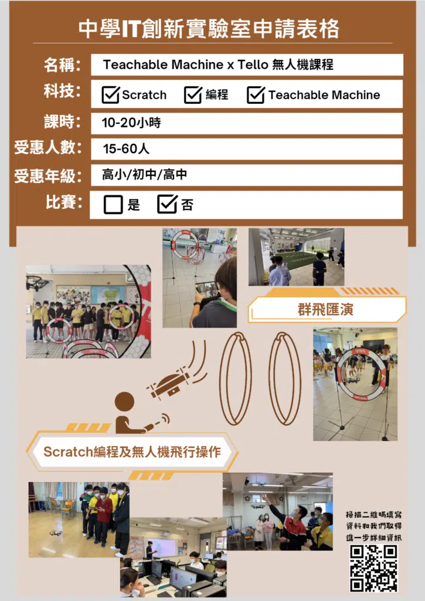

## 奇趣IT識多啲計劃
爲了透過課外活動啟發小學生對資訊科技的興趣、認識及應用，政府由2021/22到2023/24三個學年，爲每所小學提供最高共40萬元的一次性撥款資助，為他們融入知識型經濟和數碼社會發展作好準備。

## 10Botics為你制定最佳方案, 提供範本輕鬆申請
## 讓遞交申請變得更簡單快捷
## 申請表格範本
- 提供簡單易明的計劃表格範本進行參考，讓申請更加不易出錯而成功獲取批核。

## 制定教育撥款方案​
- 可協助學校準備IT創新實驗室申請表格和申請程序，並幫助構思一站式計劃幫助學校活用款項舉辦各類STEM活動。

## 協助學校解決申請上的問題
- 瞭解和迎合學校不同需要（例如配合學校解決有關添置設備上的疑慮）

## 我們已有申請「奇趣IT」計劃的成功實例，並有豐富經驗及可靠導師團隊全力支援學校。
## 可靠的導師和團隊
## 資歷全面的STEM導師
- 導師能夠應付不同STEM Day活動和恆常課程需要，不論是人數較多的禮堂講座，還是人數較少的班房式課堂。讓老師無後顧之憂。

## 經驗豐富的STEM團隊
- 在出標書階段，我們先後協助每間學校制定適合的課時，並協助配搭不同的STEM課程和課外活動組合供學校選擇，確保配合學校的進度和時間。

 - 對於年度報告的遞交經驗豐富，瞭解報告所需要求，我們能夠協助學校並提供所需的的資料。

## 想在計劃截止前申請？
[與我們聯絡了解更多](#form)
## 計劃資助範疇

## IT設備和設施
-採購或租⽤硬件、軟件及服務器等服務

## IT相關課程
-人工智能課程

-流動應用程式編程班

-無人車競賽

-無人機編程

## 其他
-活動營運開支（例如為支援學習而設的維修保養，專業服務，外聘導師）

-行政費用（會計和審計服務）

## IT相關課外活動
-舉辦或參與本地和非本地比賽

## 計劃流程
### 出標書
### 收到批核結果
### 遞交申請表
### 提交年度報告
### 開展相關IT課程和活動
## 更多小學精選課程		
										計劃申請時間在計劃期（2021/22至2023/24學年）內，申請學校可全年提交申請。審批時間收到申請後大約一個月或以上，視乎申請是否完整、當時收到的申請數目和評審委員會的會議次數而定				
														Previous slide
														Next slide
		[paperform zevqndzm no-scroll=1]
