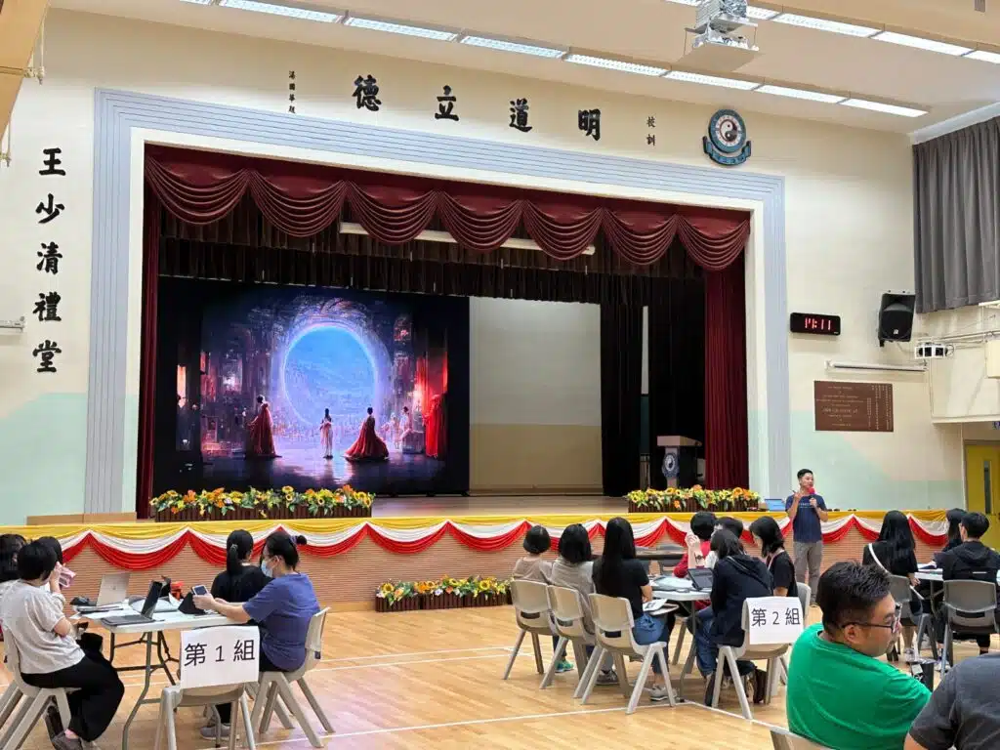

人工智能已經進入我們的時代，對於教師而言，如何善用人工智能來協助我們的日常教學工作，例如撰寫範文、設計教材等，以提升教學品質，同時培養學生的自主學習能力，成為一個重要議題。

昨天，在香港道教聯合會圓玄學院第一中學的教師培訓日中，老師們將事先準備好的教學材料上傳到AI系統，然後按各科目教學需要與ChatGPT進行了有關科目內容的對話，他們在接下來的分享環節中表示這對節省時間和提升評分一致性非常有幫助，並期待將其應用於他們的日常教學工作中，以提高教學質量和效率。

另外，許多老師都對AI生成式圖像的成果感到驚喜，透過輸入文字指令以生成圖像，他們表示此有助學生的跨學科 (視藝、英文、STEM) 學習進程，也同時豐富了他們的教學材料的視覺元素。這個新工具為他們開啟了一扇窗戶，進入了教育領域的未來。

## 更多活動相片

[embed-google-photos-album link="https://photos.app.goo.gl/QzsnHyJ2Rvjn4kBj6"]