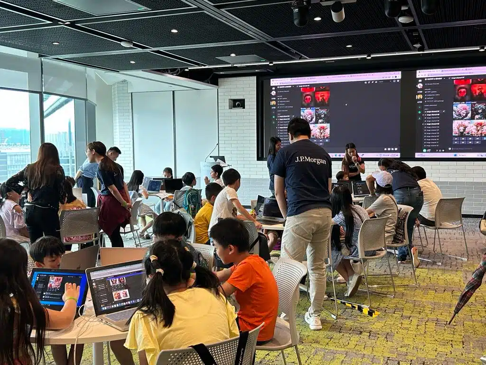

在工作坊中，學生們學習了如何使用AI機械人，輸入指令和參數，創造出獨特的藝術作品。他們可以根據自己的喜好和想法來調整這些參數，創造出完全個性化的作品。

是次工作坊最大的亮點是家長和學生們的互動和合作。家長們不僅是參與者，也是同學們的學習夥伴。他們相互交流，並討論創作的過程和成果。其後，每位參與者均將自己創作的藝術作品印出來作紀念🌟

是次與J. P. Morgan的合作，為學生和家長們提供了一個難得的機會，讓他們深入了解和體驗人工智能在藝術領域的應用。這種科技與藝術的結合不僅豐富了他們的暑假活動，還培養了他們的創造力、解決問題的能力和科技素養。

期望日後會有更多機會為學生和家長們帶來更多有趣的學習體驗，好讓學生們能夠繼續探索科技和藝術的交融，發揮他們的創造力，為未來的世界帶來更多啟發！

## 更多活動相片

[embed-google-photos-album link="https://photos.app.goo.gl/aRGFtP2h8ZUHBTFR7"]
