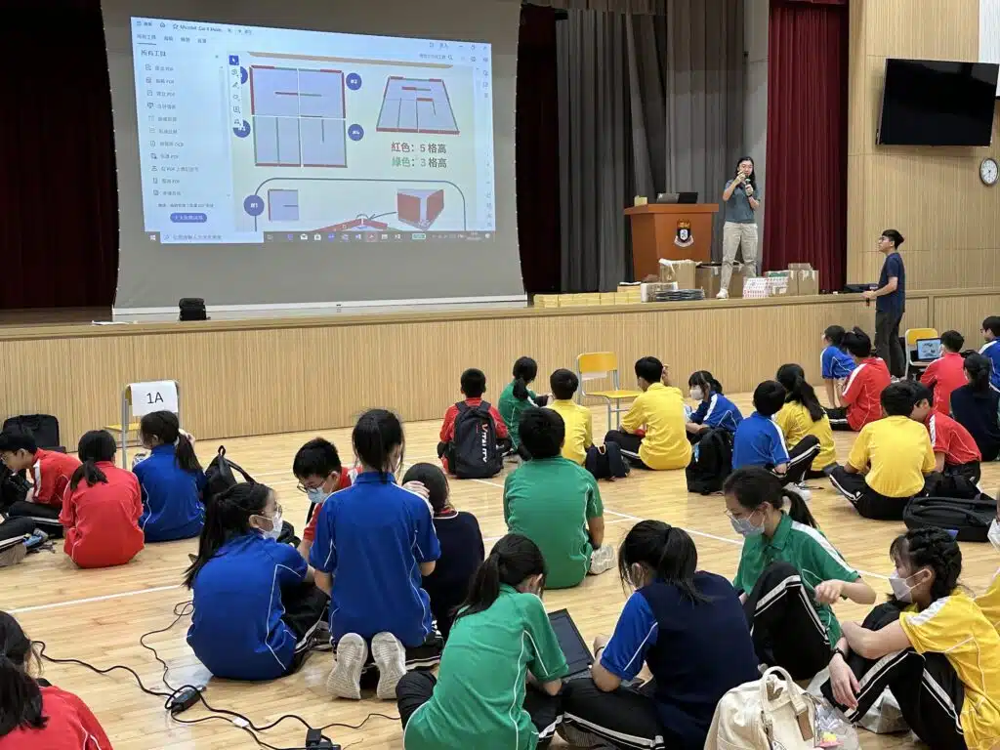

中一迎新日就一定係坐定定聽講座？唔一定嘅！好似文理書院 (九龍) 既準中一同學仔咁，佢哋今日玩足五個鐘頭Micro:bit智能小車同埋逃出迷宮比賽！🛞🏍️

於今次STEM Day迎新活動中，同學們首先學習如何編程操控Tiny:bit小車，控制小車的移動和轉向，並在迷宮中尋找出口的路徑。隨後，學生們進一步探索如何應用不同的傳感器和人工智能來設計車輛，令它能夠自主逃脫迷宮。

在接下來的比賽中，學生們需要分組合作，共同設計並操控自己的智能小車逃出迷宮。他們需要密切合作，共同探索迷宮的路線，期間更要不斷改善自己的編程策略，以確保小車能夠順利找到出口，對於初接觸編程的學生來說，實在非一件易事👀

是次活動為準中學生們提供了一個寶貴的學習機會，能夠讓他們體驗編程的樂趣。期望這些技能能夠伴隨他們成長，在日後探索科技路上發揮重要的作用。

## 更多活動相片

[embed-google-photos-album link="https://photos.app.goo.gl/5vaZzgQyumWuK5Eh8"]