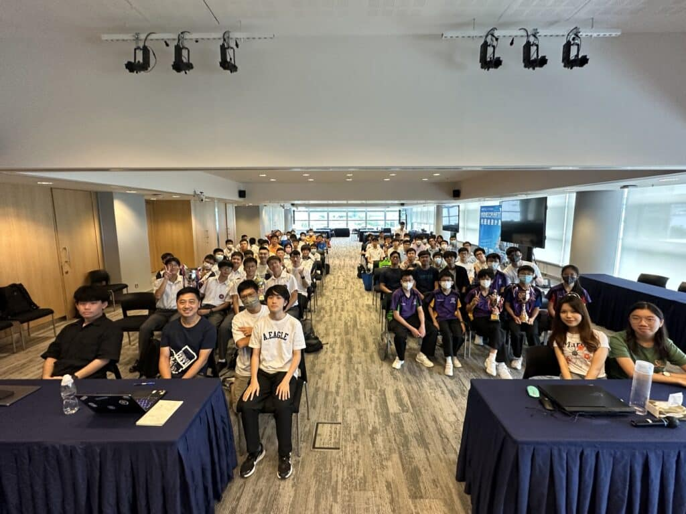

話咁快暑假已經結束，回顧今年暑假，學生們以「Minecraft 校園創建計劃 2023」充實自己，首先參加了十多小時既Minecraft課程，學習建設自己既校園及周邊設施。最後，幾個月的學習旅程以今個星期一 (8月28日) 舉行之成果發佈會作結。來到賽事的第三年，「Minecraft 校園創建計劃 2023」 完滿結束!

今年九間學校隊伍的參賽者首先於早上即時抽取題目並於短短兩小時內即場進行城市建設，並與大家分享早前建造學校的心得和作品，同學們的作品還原度極高，令人驚嘆。他們不僅在虛擬世界中展現出色的建築技巧，還將自己學校的特色和文化融入到作品中，呈現了獨特而多元的創意。

在數個月期間，學生們學會了如何運用Minecraft進行建築，更培養了團隊合作、解決難題和創新思維的能力。是次計劃為他們提供了一個實踐和展示自己創意的平台，讓他們在娛樂中獲得了學習的樂趣。

恭喜所有得獎者! 得獎名單如下：

(第一部分) 校園創建

最佳影片獎：南亞路德會沐恩中學 (影片連結：https://youtu.be/9MVH4_XN7kg) 及 瑪利諾神父教會學校 (影片連結：https://youtu.be/Z8MDhwWy_6c)

最佳匯報獎：香港中文大學校友會聯會陳震夏中學

我最喜愛校園人氣獎：高主教學校 及 香港中文大學校友會聯會陳震夏中學

季軍：東涌天主教學校

亞軍：高主教書院

冠軍：中華基督教會蒙民偉書院

(第二部分) 即場城市建設

季軍：香港中文大學校友會聯會陳震夏中學

亞軍：高主教書院

冠軍：五旬節聖潔會永光書院 (第一組)

(第三部分) 全場總成績

最佳團隊合作獎：瑪利諾神父教會學校

全場總季軍：香港中文大學校友會聯會陳震夏中學

全場總亞軍：五旬節聖潔會永光書院 (第一組)

全場總冠軍：高主教書院

再次恭喜所有得獎者，同時亦想讃揚各位同學於這數個月的付出和努力，能夠在短時間內完成眾多出色的作品，絕非一件易事。

Minecraft校園創建計劃 2023 官方網站：https://10botics.com/competition-minecraft2023/

各組匯報影片: https://www.youtube.com/@10botics/featured

感謝各位的踴躍參與，我們明年再見！

## 更多活動相片

[embed-google-photos-album link="https://photos.app.goo.gl/v7wqB7m6MCje1HM18"]
