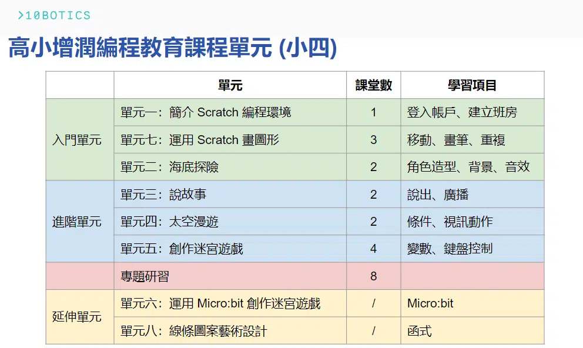
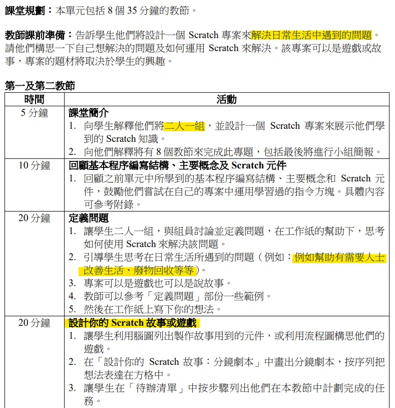
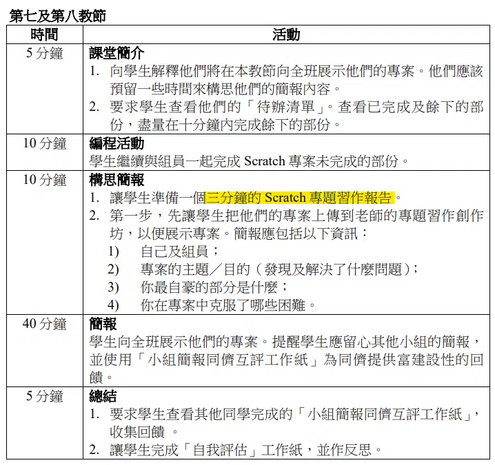
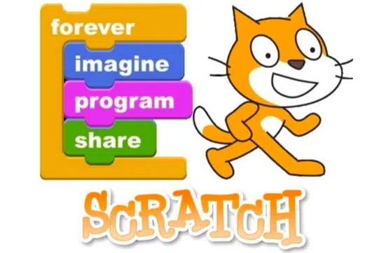
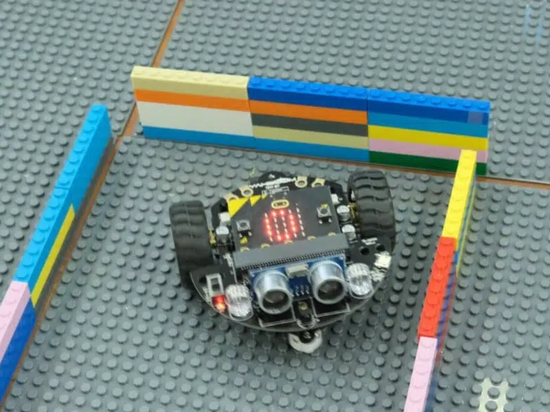

「高小增潤編程教育課程單元」是教育局 2023 年 6 月推出課程單元。

課程單元共有 6 個核心單元， 建議課時為 10 至 14 小時，另設 2 個延伸單元。我將 6 個核心單元分為入門和進階單元 ( 如下圖 )。課堂數是我按照單元的難易度和單元之間的配合推薦的，與手冊的有些不一樣，老師亦可以根據學生的能力調整。

## 專題研習

專題習作需要 2 個學生一組設計一個故事或遊戲，展示解決日常生活問題的方案，最後每組需要完成 3 分鐘口頭報告。更多細節可以參考教師版本第二冊的 166 至 169 頁。

## 入門單元

單元一的前半部份是登入帳戶、建立班房，然後試玩 Scratch 已有的專案。後半部份則介紹創建背景、角色、移動等，內容與單元二和七有些重疊。而且 Scratch 最入門的遊戲是畫畫，即單元七的內容。所以我認為單元一的後半部份可以直接跳至單元七。

### 單元七專案

https://youtu.be/V-3giViMV1s

https://youtu.be/_0LZBlLc7Bw

[打開專案 (第一部份)](https://scratch.mit.edu/projects/737338011/editor/)

[打開專案 (第二部份)](https://scratch.mit.edu/projects/737402437/editor/)

單元七分為兩部份，第一部份是用筆畫畫簡單圖形，如方形、多邊形；第二部份是用重複方塊畫一些圖案，如雪花。這個單元最重要讓學生能熟悉使用重複方塊編程。

### 單元二專案

https://youtu.be/5kbwERFJXjI

[打開專案](https://scratch.mit.edu/projects/722781437/editor/)

單元二主要關於創建角色造型、背景和音效。這個時候可以開始跟學生 brainstorm 專題習作的主題，因為無論設計故事或遊戲都需要這些元素。整個單元二及設計專題習作的角色和背景大概需要 3 至 4 節課堂，讓學生可以上網搜尋圖片然後改圖或自行繪畫角色和背景。

當學生完全掌握重複方塊，便可前往進階單元。

## 進階單元

由於進階單元 (單元三、四、五) 使用的方塊都需要較強的邏輯理解，老師需花較多時間解釋使用那方塊背後的邏輯和不同的使用情境。

### 單元三專案

https://youtu.be/13_JkPdOAU8

[打開專案 (改編前)](https://scratch.mit.edu/projects/761138953/editor/)

學生透過單元三學習如何使用廣播方塊讓角色們能夠流暢地對話和轉換背景。學生需要改編影片中的專案，將等待方塊換成廣播方塊，改編後的編程可參閱第一冊的第 102 及 105 頁。在專題習作中，廣播方塊較常用於切換場景或關卡，所以可以多放時間讓學生熟習使用。

### 單元四專案

https://youtu.be/Vh_VET5zsyM

[打開專案](https://scratch.mit.edu/projects/727401089/editor/)

這個單元需要與鏡頭互動。當我揮手時，角色會移動或轉換背景，當中使用了利用鏡頭靈敏度的視訊動作方塊。雖然這單元包括了運算符和條件句式，但是視訊動作方塊較不常用，所以我認為不用花太多時間學習有關視訊動作的各方塊，學生只需認識基本的運算符和條件句式，便可進入單元五。

### 單元五專案

https://youtu.be/VtqSnZ8EUnY

[打開專案](https://scratch.mit.edu/projects/722154863/editor/)

學生需要學習變數和條件句式創作遊戲，影片中的專案只展示用鍵盤控制角色移動和計分系統，學生當然可以製作更多遊戲規則和計分機制，做出不同關卡的迷宮遊戲，甚至設計其他遊戲，例如打地鼠、射擊遊戲。我認為這是最需要亦最值得花時間學習的一個單元。

完成這些單元後學生應該有能力完成小組專題習作

## 延伸單元

延伸單元並不包括在建議課時的 10 至 14 小時中。這兩個單元是其中兩個核心單元的延伸，學習內容更複雜但學習的概念更貼近其他非方塊編程語言，如 Python，為學生未來編程作準備。

### 單元八專案

https://youtu.be/_OMKbBlWOBA

[打開專案](https://scratch.mit.edu/projects/737985288/editor/)

單元八是畫圖 (單元七) 的延伸，將多次重複的程式改成函式 (function)。

### 單元六專案

https://youtu.be/TufXsJSY2J0

[打開專案](https://scratch.mit.edu/projects/734745981/editor/)

單元六是迷宮遊戲 (單元五) 的延伸，製作遊戲數據分析和將 Micro:bit 變成一個遙控來控制畫面上的角色，手冊第 62 至 66 頁包括 DIY 遙控制的說明。不過我想製作實體迷宮會更有趣吸引。Micro:bit 擴展車代替了遊戲角色，然後在課室拼一個迷宮便完成一個簡單的實體迷宮遊戲。而且 Micro:bit 擴展車上通常有各種感應器，例如超聲波感應、紅外感應、循線感應等，讓學生既學到不同感應器的運作，又可以體驗電腦內的迷宮與現實迷宮的不同玩法。

## 相關到校課程推介

學生將學習使用 Scratch 編程，體驗遊戲的開發過程，從中學習遊戲設計須認識的概念及編程技巧，創作自己的遊戲。

[了解詳情](https://10botics.com/school-courses/scratch-game-design/)

學生將學習如何運用不同的技術，合作構建並編程一個能夠自主逃脫迷宮的 Micro:bit 擴展車，培養學生的創造力和解難能力。

[了解詳情](https://10botics.com/school-courses/microbit-maze/)
