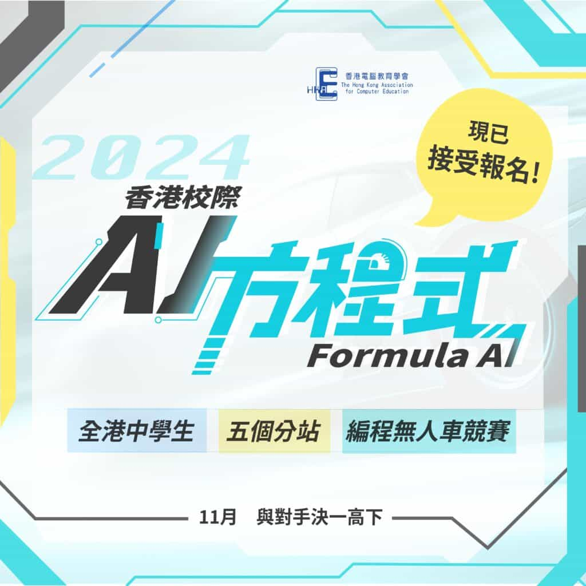

Formula AI 香港校際 AI 方程式 2024

編程無人車競賽 與對手一決高下

經過去年七場激烈的賽事，15間學校總計30隊的同學齊聚一堂，爭奪香港校際AI方程式首屆總冠軍的殊榮。每一站比賽同學都全力以赴，即使面對不同困難和挑戰，他們都嘗試努力克服，過程中的毅力和堅持令人印象深刻。

10Botics 將繼續於 2023-2024 學年舉辦香港校際 AI 方程式 2024，期望透過這項賽事推動學生以小型無人車應用人工智能，進一步提高編程技巧，並深入了解人工智能及無人駕駛技術，為未來創科行業培養人才。

今年賽事將由 5 個分站組成，每個分站將於不同學校或遙控模型賽車場舉行。另外，今屆賽事將引入新型號賽車，同學有更多機會提升賽車性能，亦令比賽更具挑戰性。每站賽事均有特定主題及考驗，包括賽道計時賽及戶外光線挑戰賽等等。除此之外，今年更新增手控組賽事及最快直路加速賽，同學亦有更多機會比拼各方面能力。

對象

- 中一至中六學生

獎項

- 分站冠亞季軍

- 年度總冠亞季軍

- 最佳機械工程師

- 最佳軟件工程師

- 最佳賽車手

- 最佳外觀獎

比賽時間及地點

- 2023年11月至2024年5月

- 樂善堂王仲銘中學、佐敦谷公園 遙控模型賽車場、循道中學、瑪利諾中學 (暫定) 及 喇沙書院

賽前工作坊 - 「組．序」

日期: 2023年10月7日 (星期六)

地點: 天主教郭得勝中學

內容:

第1部分 (10:00am-10:30am): 2024 賽季簡介

第2部分 (10:30am - 3pm): 組裝新款賽車及測試

有關比賽詳情及新型號賽車，我們將於10月7日舉行賽前工作坊講解賽制並教授同學組裝新賽車。名額有限，有興趣的同學請盡快報名：https://fbqb7zgf.paperform.co
