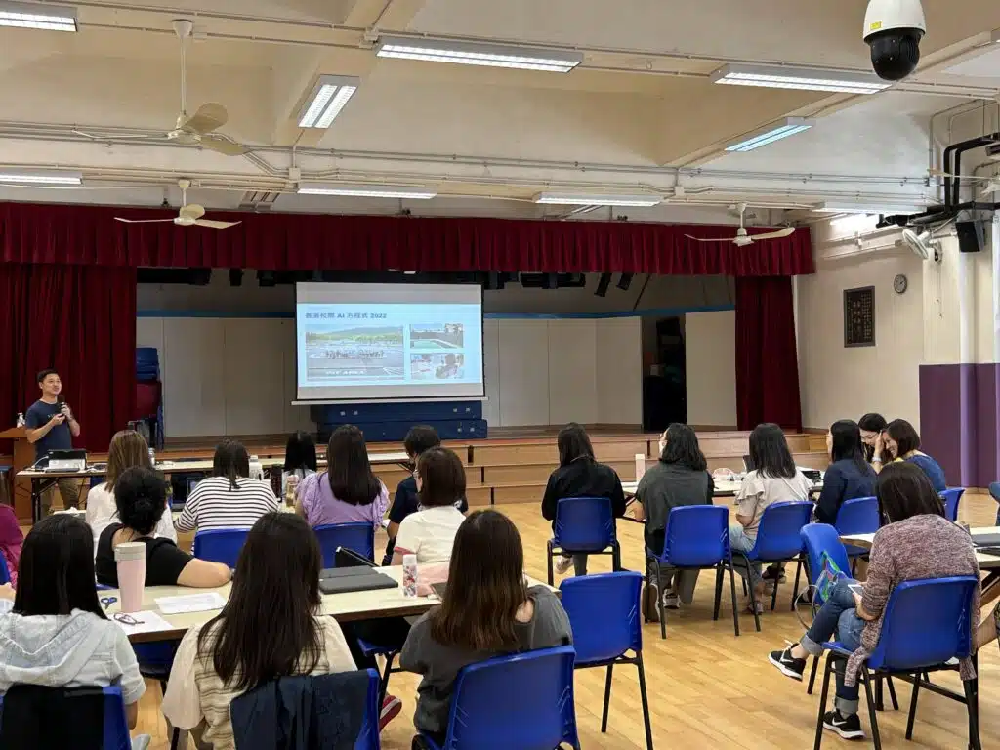

教育一直是不斷進步和創新的前沿領域，人工智能，是我們的新夥伴，將為老師們提供更多教學的可能性，幫助我們更好地引導學生走向知識的深處。

在中華基督教會基灣小學的教師培訓講座中，老師們就各科教學需求跟ChatGPT展開對話，藉著ChatGPT支援重複性較高的工作，例如擬訂測驗題目、設計教學活動及編排課程教案。其中，老師們對AI圖像生成功能最感到驚喜，以英文科為例，老師可利用POE內的Stable Diffusion Bot，根據輸入的關鍵字句，輕鬆生成4格漫畫，在撰寫按圖寫作試題時起到關鍵作用，為學生提供更多的個性化互動體驗，

## 更多活動相片

[embed-google-photos-album link="https://photos.app.goo.gl/sVykCRzPBXnjRqxi7"]
