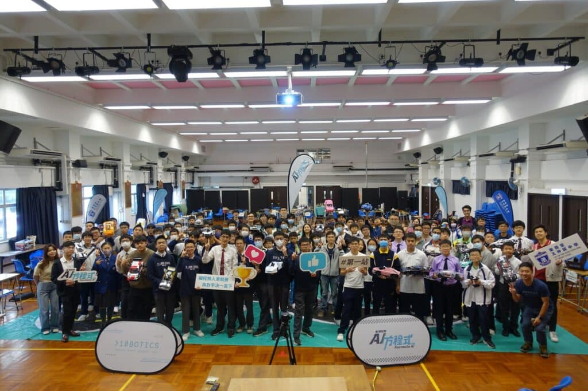

我地相信本站賽事可能創下咗近年香港學界活動中的一項紀錄 - 即有眾多位學生在同一時間、同一地點進行遙控無人車比賽🧐🚘

10Botics於12月2日 [樂善堂王仲銘中學](https://www.wcmss.edu.hk/)舉行了 香港校際AI方程式 2024 第一站賽事，有賴近20間學校，總共過100名學生的支持及積極參與，賽事完滿結束🌟🌟🌟值得一提的是，有近一半的學校是連續第二年參加比賽，並在本學年繼續挑戰自身極限。

本站賽事中，參賽隊伍攜同自己親自組裝好的車輛，進行手控、自動駕駛及直路賽。參賽學生在緊張刺激的氛圍中，將自己對科技的熱情與創造力轉化為實際操作。特別是在自動駕駛項目中，學生們需要運用先進的編程技能，確保他們的車輛能夠在沒有人為操控的情況下，準確地完成賽道。

🎊香港校際AI方程式 2024經已展開序幕，接下來的幾個月內，多位參賽者將繼續進行密集式的培訓課程，以準備迎接下一站的挑戰。下一站賽事將於2024年1月13日 佐敦谷公園 遙控模型賽車場舉行，期待各位的參與，我地到時見！

## 更多活動相片

[embed-google-photos-album link="https://photos.app.goo.gl/7V1TLzcrfJCU48Dp7"]
