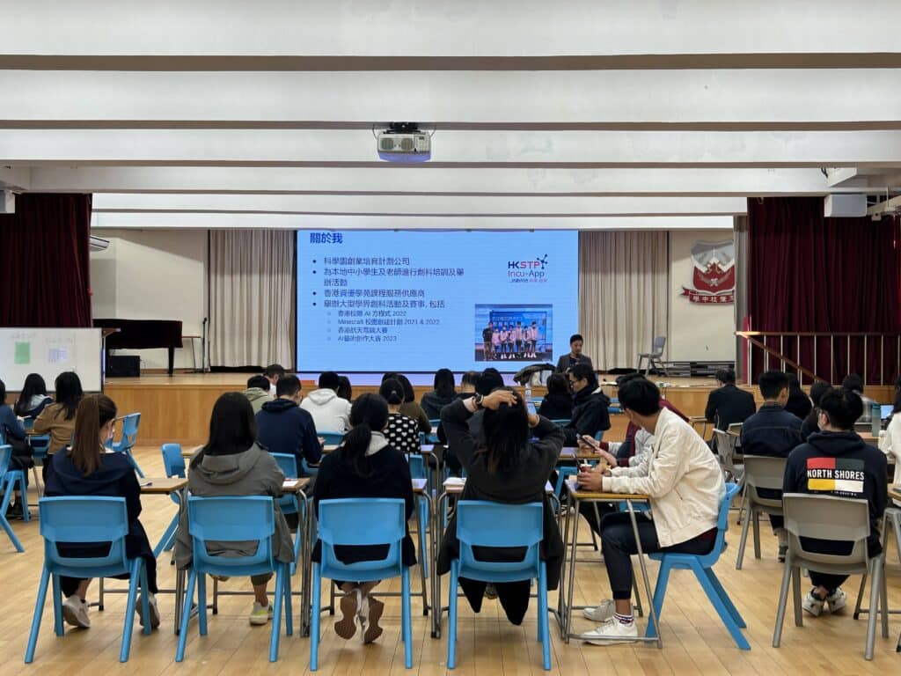

在當今這個快速發展的時代，人工智能（AI）已經成為推動教育創新和進步的重要力量。最近，我們有幸再次受到學校的邀請，來到王肇枝中學，分享人工智能在教學中的應用，開展了一場充滿啟發性的三小時分享會。

在這次分享會中，我們聚焦於AI的最新發展，老師們按照所教授的不同科目分組進行工作坊，他們嘗試利用ChatGPT來製作教材、試卷以及相對應的評分準則。這個過程不僅提高了他們製作教學資源的效率，也為他們提供了一種全新的、與學生互動和評估的方法。

我們相信，隨著AI技術的不斷進步和完善，它將在未來的教育領域扮演更加重要的角色，為學生提供更加豐富多彩和個性化的學習體驗。

更多活動照片

[embed-google-photos-album link="https://photos.app.goo.gl/5btrPvdtyMaCdbQH8"]