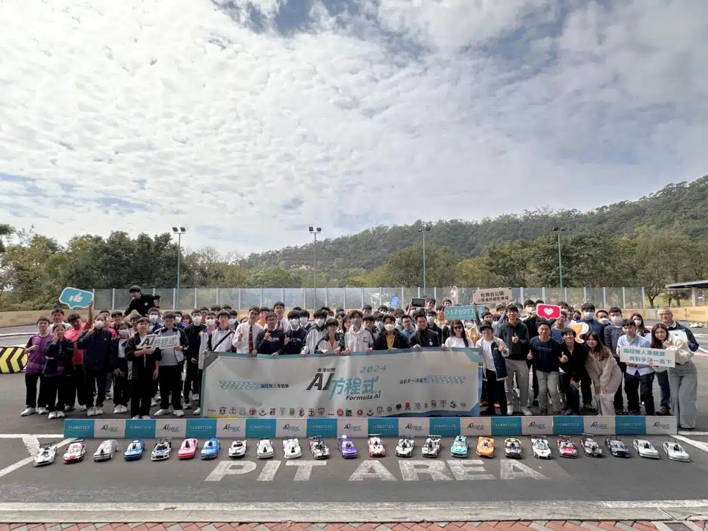

#香港校際方程式2024 #FormulaAI2024

10Botics在上周六 (1月13日) 於 #佐敦谷公園 舉行的第二站賽事，為香港校際AI方程式2024增添了更多挑戰感謝近20間學校和100多名學生的熱情參與，讓這場賽事取得了圓滿的成功。

今次比賽既賽道比以往都要廣闊，且全部在戶外進行。陽光的變化對數據收集和車輛控制造成影響，使得實現精準自動駕駛變得更加困難。喺有限既時間內進行數據收集並完成計時賽，絕非易事，遠比之前在學校室內進行既比賽難度高。

喺接下來既多站賽事中，學生們將有多次練習既機會。唔單止係一次賽事，更係一個學習同成長既過程。每一站既經驗都將為佢地喺下一次賽事改進提供寶貴既機會。下一站賽事將於3月23日 [瑪利諾中學](https://www.maryknoll.edu.hk/)舉行，期待見證各位學生既進步！

## 更多活動相片

[embed-google-photos-album link="https://photos.app.goo.gl/tDgJEEXQjhcohPcd6"]
