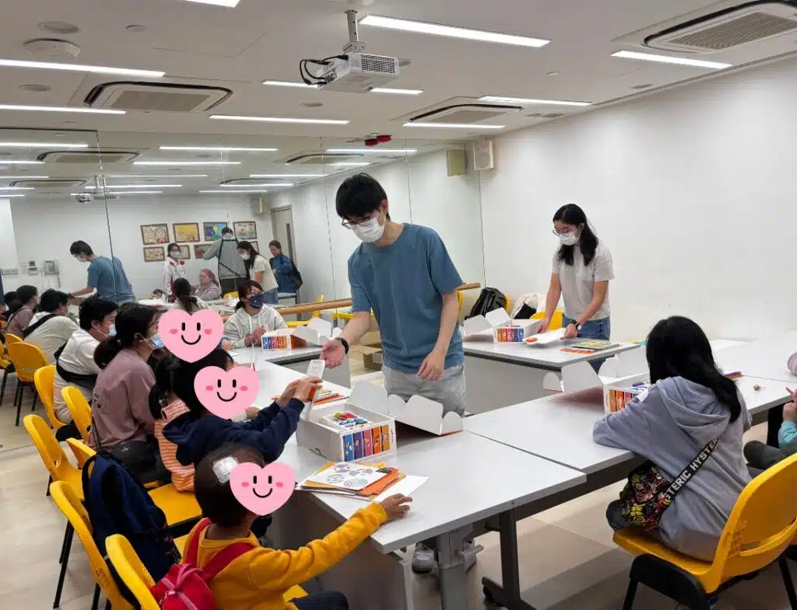

#兒童癌病基金會 #STEM體驗工作坊 #社會責任

喺上年底，我哋收到兒童癌病基金會既查詢，希望我哋為佢哋既陽光小子提供STEM體驗課程。當我地了解咗籌辦今次工作坊既初衷同意義後，我地決定免費為佢地提供幾次STEM工作坊，希望可以藉住各種有趣味性既STEM體驗，為佢地打氣加油。

由於學員們既年齡層分佈得比較廣，我地就特別安排左適合初小玩既 Matatalab 無插電編程積木，同埋高小同初中玩既 Dobot 機械臂。見到佢地成功利用指令控制到機械人，面上流露出來既笑容，我地都從中得到力量同滿足，同時非常欣慰可以為我地平時做開既STEM課程，增添上一重意義。

在此我哋非常感謝 Union Enterprise 無償借出 Dobot 機械臂俾我地。佢地一聽到我地既服務初衷，就爽快答應，令今次既Dobot機械臂工作坊得以順利完成，一眾小朋友都樂在其中🌈

我地希望透過今次既社會服務，唔單止係傳授知識，更重要既係，通過科技教育回饋社會。如果貴機構有呢方面的需求，歡迎聯絡我地合作，共同為社會上有需要既人貢獻我地既一份力量，一同創造更多意義深遠的影響。🌱💪

## 更多活動相片

[embed-google-photos-album link="https://photos.app.goo.gl/J5km36gfbHnd3arw5"]