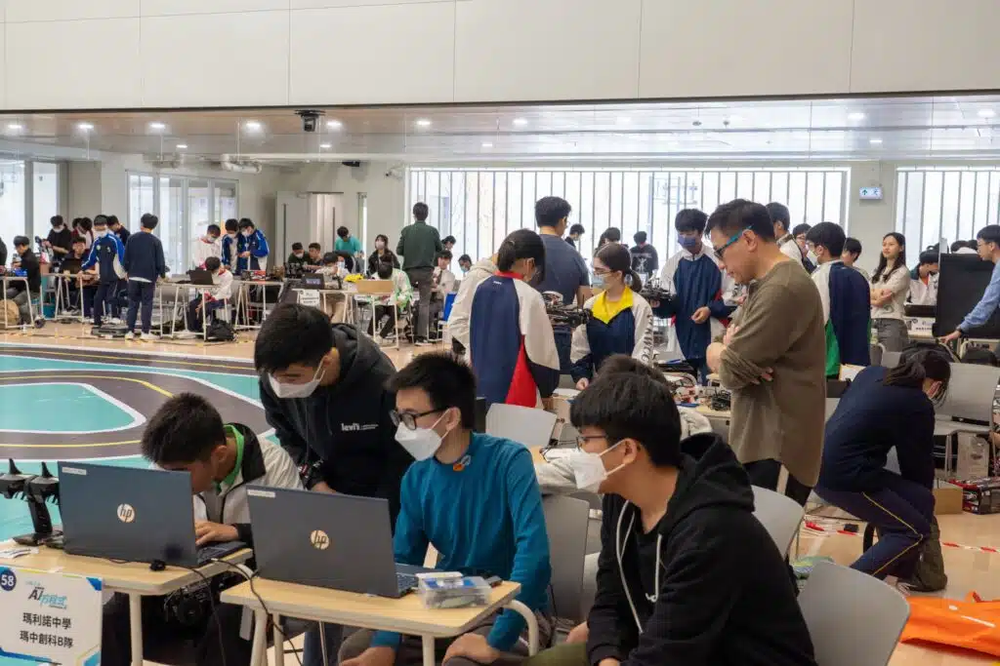

#香港校際方程式2024 #FormulaAI2024

我哋上星期六喺瑪利諾中學舉行咗2024年嘅第三場Formula AI賽事🏎️，今次比賽最大嘅創新之處，就係我哋事前製作咗賽事地點嘅模擬場景，讓學生們可以喺模擬賽事前收集模擬數據📊，並同現實生活中嘅數據結合嚟訓練無人模型。

模擬器令學生可隨時收集數據及測試模型，令學生有更多機會改善無人駕駛表現。

模擬器亦加入新功能，例如調整視野範圍、車輛速度同阻力等，令模擬環境更貼近現實世界。值得一提嘅係，當日總共有12支隊伍成功地利用模擬器同現實數據結合，實現自動駕駛🎉！

🔥今次嘅模擬器訓練為學生帶來咗全新嘅挑戰，促使佢哋喺學習遙控無人車駕駛嘅路上精益求精。下個月，我哋將會回到佐敦谷公園，好奇班學生嘅表現會點樣？讓我哋拭目以待，期待見到佢哋嘅進步同成長！

## 更多活動相片

[embed-google-photos-album link="https://photos.app.goo.gl/fFFTf67V9tiJEooPA"]