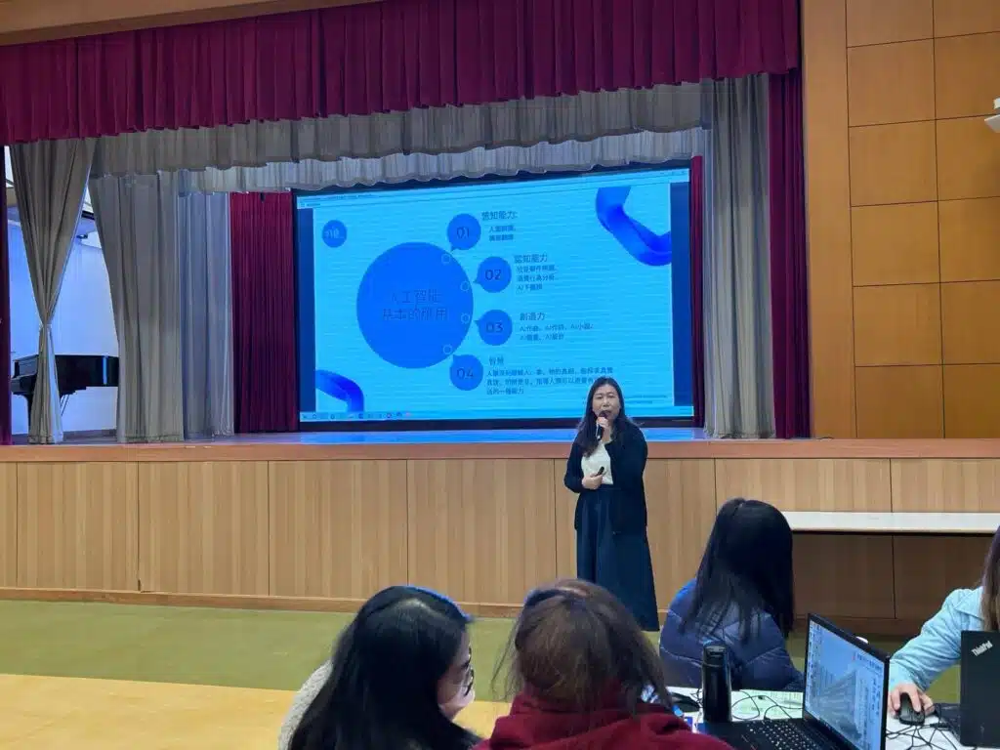
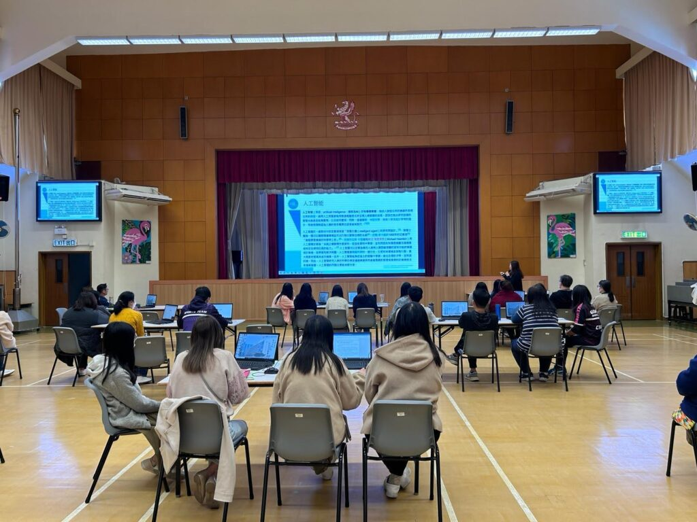

#教師發展日 #人工智能 #AI教學 #一鍵生成PPT

在最近的一次活動中，我們有幸走訪了[葛量洪校友會黃埔學校](https://www.grahambs.edu.hk/)，為那裡的教師們帶來一場關於如何利用ChatGPT來協助教學工作的專題演講。此次活動不僅增進了教師們對人工智能技術的理解，也探討了ChatGPT在日常教學中的實際應用，特別是在準備教材和互動式學習內容方面的巨大潛力。

演講重點：ChatGPT的教學應用：介紹了ChatGPT如何幫助教師節省準備課程的時間，提高教學效率。提示工程學：解釋了什麼是提示工程學，以及如何有效地利用這一技術來引導ChatGPT產生高質量的教學內容。AI輔助課件製作：展示了如何使用ChatGPT輔助創建PowerPoint演示文稿，使課件更加吸引人且富有教育意義。

此次活動為在場的教師們提供了一個寶貴的學習機會，使他們能夠更深入地了解並運用AI技術，來豐富教學內容和提升教學質量。我們相信，通過這樣的交流和學習，可以進一步推動教育領域的創新發展。

## 更多活動相片

