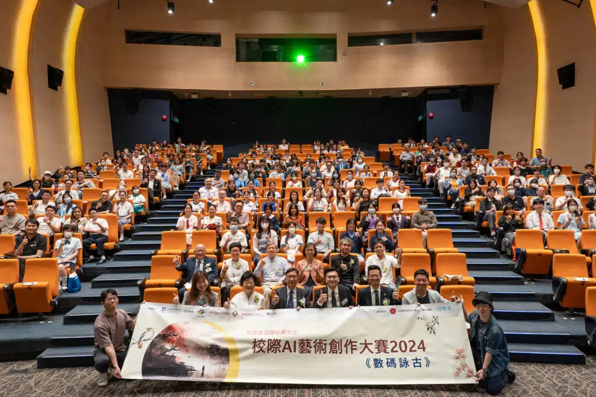

校際AI藝術創作大賽 2024《數碼詠古》之頒獎典禮及得獎作品展覽 於4月15日——即 國家安全教育日 完滿結束! 今年的主題是「重現中國詩詞歌賦之意境」，全港中小學生利用AI圖像生成軟件展現對傳統文化的現代詮釋，進一步提升對國民身份的認同。

本次比賽收到來自各中小學的2700份作品，學生們以其創新思維和技術技能，將傳統文化的精髓轉化為一幅幅生動的AI藝術作品。經過專業評審團的細心評選，最終有100名學生突圍而出，並於日前榮獲各項殊榮，而他們的傑作亦於展覽中展出，學生與老師、家長得以共享得獎之榮耀與喜悅。

頒獎典禮上，香港電腦教育學會 主席 朱嘉添校長亦讚揚了學生們對傳統文化的現代詮釋和創造力的發揮，並期待未來見證更多結合科技與藝術的教育創新。

「推廣中華文化體驗活動一筆過津貼」教育局日前宣布向學校發放30萬元「推廣中華文化體驗活動一筆過津貼」，各校現有機會運用此筆撥款舉辦各種深入探索中華文化的活動。《數碼詠古》大賽整合了科技與中華文化教育，雖然比賽經已結束，學校仍可利用這筆撥款，參與相關課程或後續活動。如貴校有興趣利用津貼來結合科技與中華文化的學習，或希望了解更多相關課程及活動，請聯繫10教育 李小姐 (6554-1506/sales@10botics.com)。

## 更多活動相片

### 頒獎典禮

[embed-google-photos-album link="https://photos.app.goo.gl/9fjPSXxo7PrA8fXa6"]

### 得獎作品展覽

[embed-google-photos-album link="https://photos.app.goo.gl/9yEEBLqvncgnhekx8"]