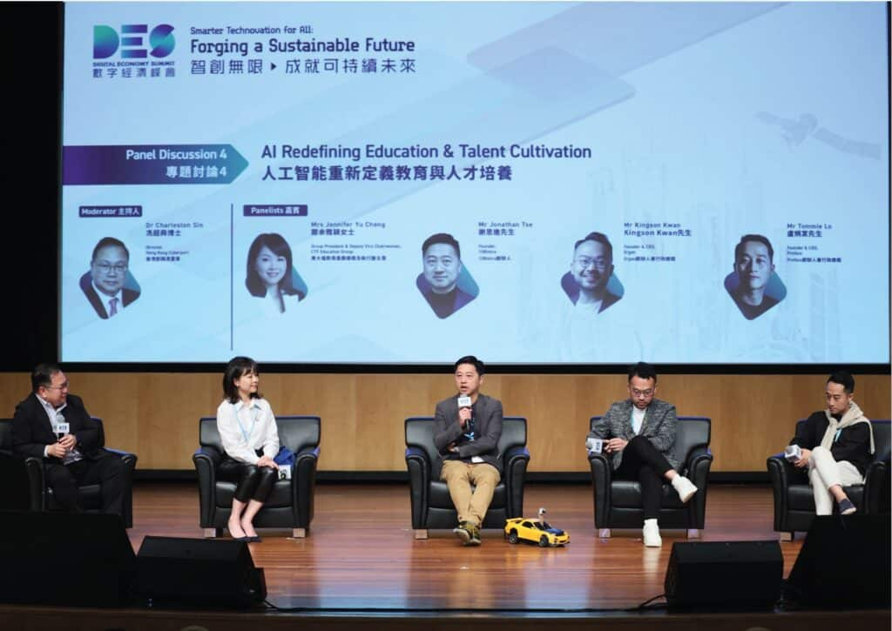
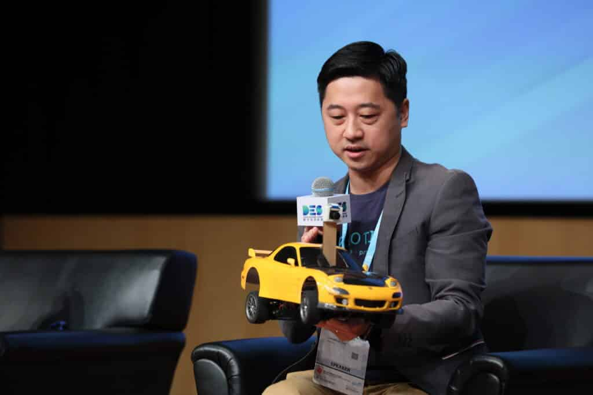
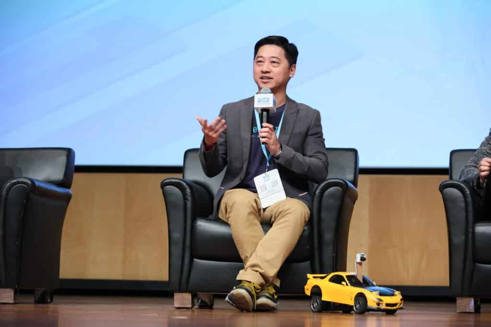
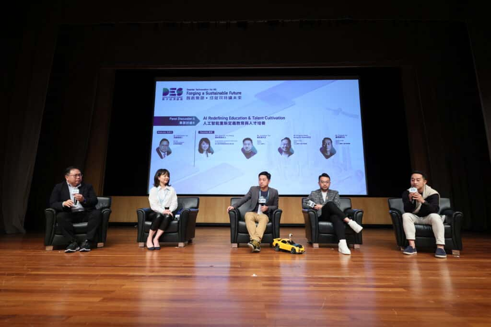
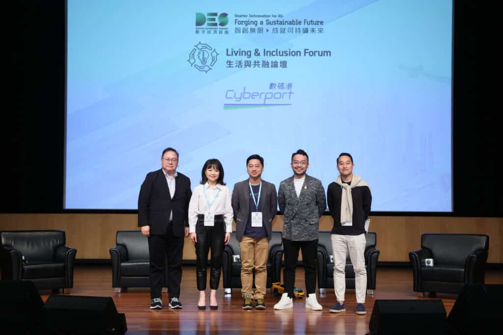

我們榮幸地參與了數字經濟高峰論壇的小組討論，討論主題為「人工智能重新定義教育與人才培養」。作為論壇的小組成員之一，我們深入探討了AI技術在當前教育體系中的應用，以及其對未來人才培養策略的影響。此次參與不僅彰顯了我們在教育技術領域的專業知識和領導地位，也強化了我們與其他行業領袖的合作關係，共同推動教育創新和人才發展的新範式。此活動的經歷是我們公司在推動教育創新和實踐中不斷努力和承諾的證明。

## 更多活動相片

### 

