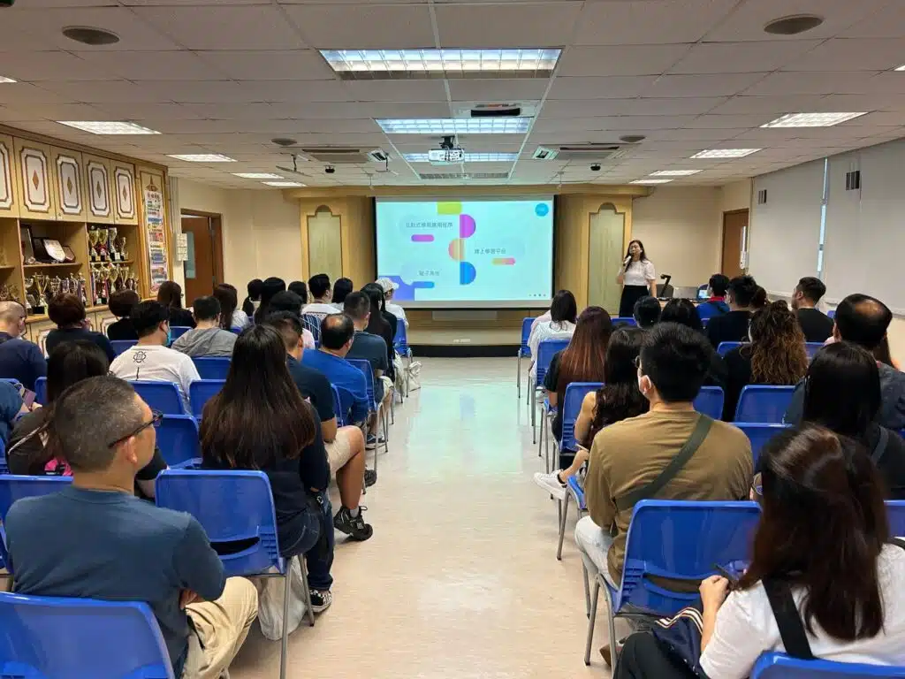

在天主教石鐘山紀念小學，我們最近舉辦了一場引人注目的家長講座，主題是「如何利用AI提升子女的學習效能」。這場活動旨在向家長們展示人工智能在教育中的實際應用，特別是它如何有效提高學習效率。我們深入探討了AI技術的實際應用，讓家長們對如何將這些先進工具融入孩子的學習過程中獲得了新的見解。

活動反饋非常正面，絕大多數家長表示他們對講座感到非常滿意，認為它不僅提供了有價值的信息，還開拓了他們的視野。家長們特別欣賞講座中對AI在教育中應用的深入解釋，這讓他們對未來的教育技術抱有更多期待和信心。一些家長表達了希望未來能有更多這樣的講座，以便深入了解和掌握AI技術。

如果您也想為您的學校或社區帶來這樣富有啟發性的講座，探索AI技術如何在教育中發揮革命性的作用，請隨時與我們聯繫。我們熱衷於分享知識，期待與您一起合作，為孩子們創造更光明的學習未來。
