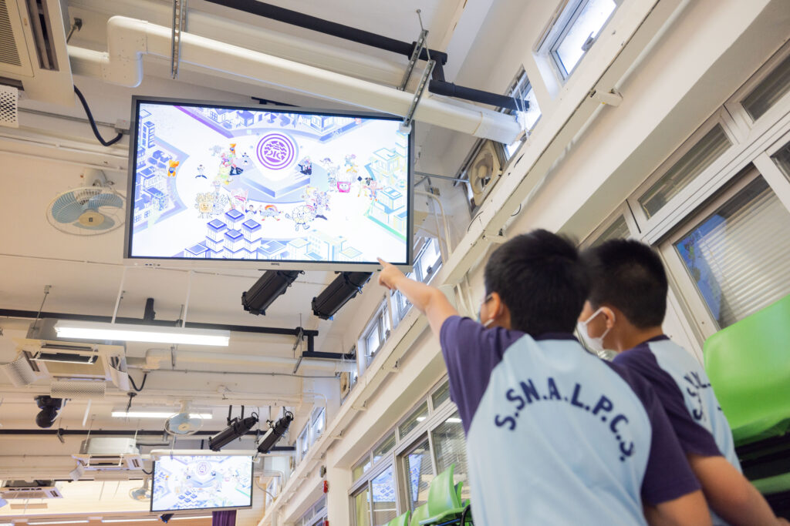

在這次以太空為主題的STEM Day活動中，[10教育](/)與[三水同鄉會劉本章學校](https://www.lpc.edu.hk/)攜手合作，為全校221名學生帶來了一場豐富多彩的科技盛宴。學生們動手參與各種精彩的STEM體驗項目，包括AI數碼動畫展、虛擬火箭設計、太空探險AR遊戲以及CoDrone無人機體驗。

活動特別針對全校小一至中六不同程度的SEN學生設計，讓每個年級的學生都能找到適合自己的科技體驗項目。學生們在AI數碼動畫展中以AI技術創作太空主題的角色並放上LED Wall，在虛擬火箭設計和太空探險AR遊戲中學習了基礎的物理和工程原理，而在CoDrone無人機體驗中，學生們學習了基本的編程和操控技術💻，並將其運用到實際操作中，大家都樂在其中👏🎉。
