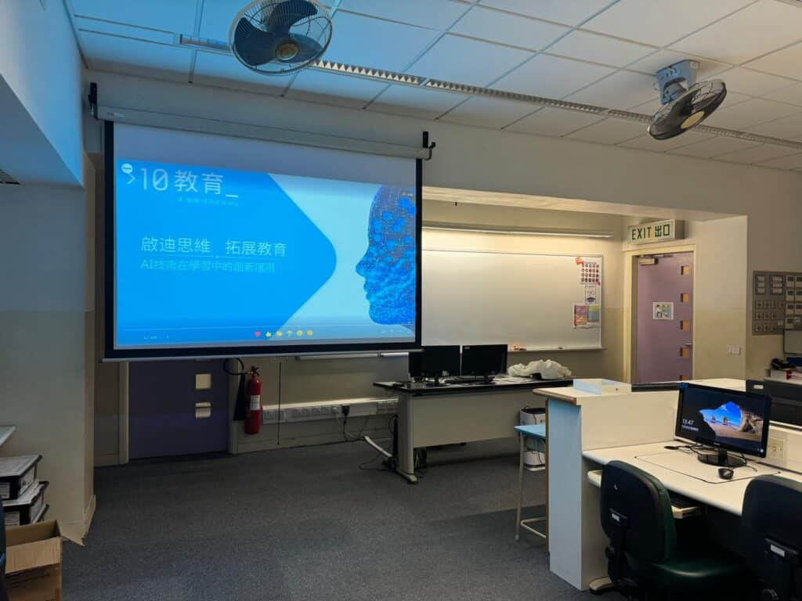

POE教學講座

聖公會柴灣聖米迦勒小學教師發展日探討POE應用：突破限制，推動教育創新在最近的聖公會柴灣聖米迦勒小學教師發展日活動中，我們與學校的常識科老師深入探討了POE的應用。在香港，由於政策和技術上的限制，許多教師無法輕易使用流行的AIGC（人工智能生成內容）工具，因此POE成為教師們的重要選擇。本次講座的目的是教授教師如何使用POE來滿足教學需求，並在不違反法律的前提下，充分利用AI技術來輔助教學工作。講座內容包括POE的安裝和使用方法，以及如何通過POE平台進行各類教學活動。

提示工程(Prompt Engineering)的應用：提升教學效率我們在講座中深入探討了「提示工程」的概念，教授教師如何透過風格調整、關鍵詞和結構來設計清晰、精確的提示，以引導AI生成令人滿意的回答。這些技巧涵蓋了文本生成、資訊檢索和圖像生成等核心功能，使教師能夠更高效地利用AI技術來改善教學效果，尤其在香港教育環境中顯得尤為重要。

實際應用場景與案例分析講座中，我們還教導教師如何使用提示工程框架來編寫他們自己的機器人（BOTs）。這些BOTs能夠自動回應學生問題，提供即時教學建議，並根據教師的需求靈活調整，為教學提供個性化支持。這樣的應用不僅提升了教學效率，還能在香港AIGC工具使用受限的情況下提供實際解決方案。

我們相信，POE技術將在教育領域發揮重要作用，特別是在目前其他AIGC工具受限的環境下。通過此次講座，教師們掌握了新的技術手段，為未來的教學創新奠定了堅實的基礎。
