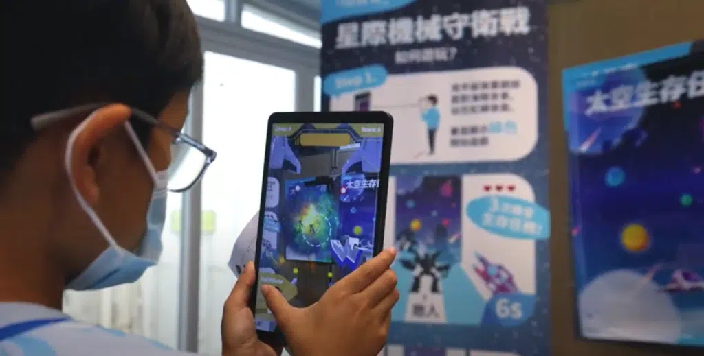
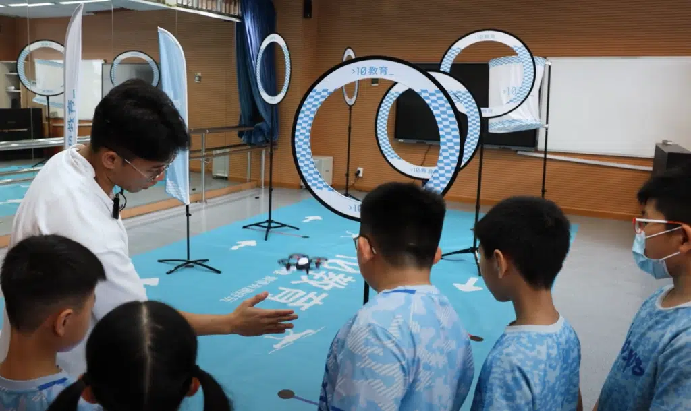
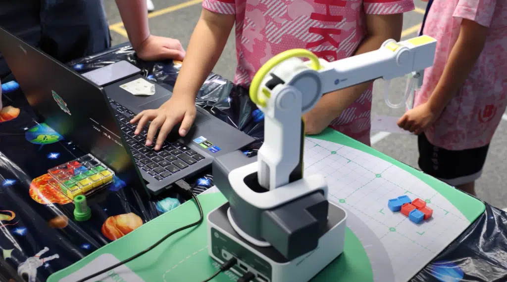
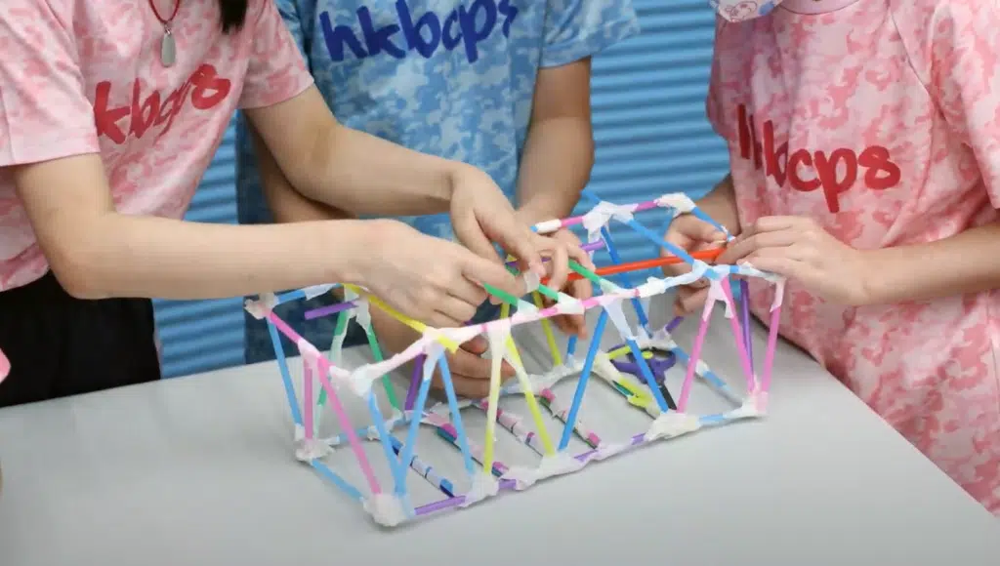
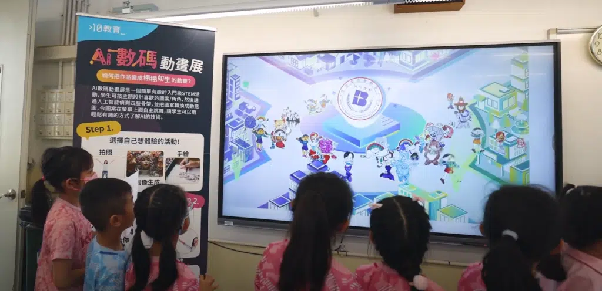

[10教育](/)早前到[香港浸信會聯會小學](https://www.hkbcps.edu.hk/)，為全校近700名小一至小五的同學舉辦了太空主題STEM Day活動。在這次活動中，學生們暢玩多個有趣的攤位遊戲，例如無人機體驗、虛擬火箭設計、虛擬太空站接駁、Dobot智能機械手臂、太空探險AR遊戲和太空探險者遙控車等。同學們對各項太空主題的攤位遊戲表現興奮，很多同學都表示這是他們第一次嘗試操控火箭與太空站進行接駁，過程極具挑戰性。

同時，同學亦參與了各種豐富的STEM體驗項目，包括AI數碼動畫展以及科學小手作。當日學生需要親手完成作品並參加班際比賽🏆。特別在飲管橋比賽中，學生們分組合作，學習橋樑的種類及力學工程，發揮創意，製作出各具特色的作品，並在比賽中展示成果，務求橋樑能承受最重的重量。現場氣氛熱烈而積極。此次STEM Day活動讓學生們在互動中學習，感受到STEM的無限魅力。各項小比賽更鍛煉了他們的團隊合作精神和激發創造力! 🤝💡

###
