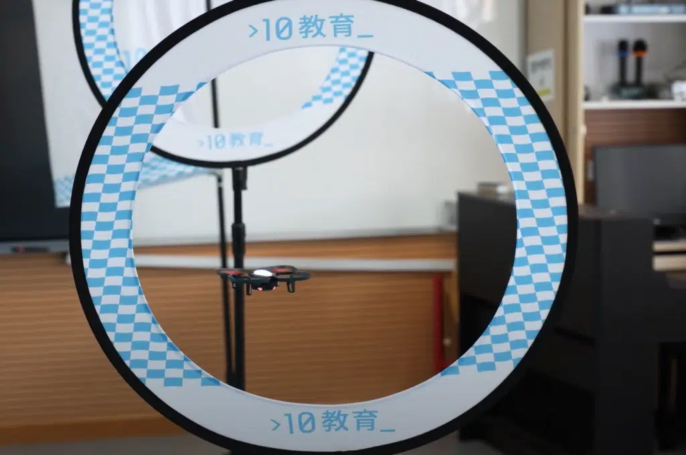

在這次STEM Day活動中，寶血會嘉靈學校全級小四學生參與了CoDrone無人機課程，共約120名學生近距離接觸無人機科技🚁，學習並操作這款最新的CoDrone EDU無人機。

學生們親自操作CoDrone無人機，學習如何起飛、降落、懸停、基本的飛行控制以及急降安全操縱，了解無人機的基本原理⚙️。雖然很多同學都是首次操控無人機，不過透過CoDrone配備的遙控手制，學生們都成功進行了一些飛行挑戰，如穿越障礙物、畫出特定圖形等，鍛煉他們的控制技能。C期望是次STEM Day可以激發他們對STEM領域的濃厚興趣，為他們打開學習無人機的篇章🛫