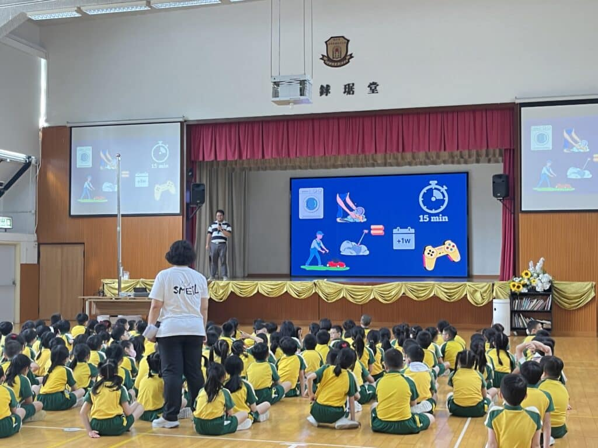

🎉正值創校30週年，10教育與勵志會梁李秀娛紀念小學攜手合作，舉辦了一場精彩紛呈的STEM Day活動。在這次活動中，全校共27班，超過600名小學生近距離接觸科技創新，動手參與各種精彩的STEM體驗項目，包括AI數碼動畫展、科學小手作及比賽、Micro:bit降落傘、Donkey Car無人車體驗、航天科技主題講座等。

值得一提的是，Donkey Car無人車本是較適合中學生操作的項目，梁小的學生卻能透過在無人車講座上所學的知識，學習操控無人車的技巧，並將其活用到實際操作上，大家都樂在其中👏🎉

此次STEM Day活動不僅讓小學生大開眼界👀，感受到科技的魅力，更重要的是激發了他們對STEM領域的濃厚興趣。培養更多卓越人才🌟

## 更多活動相片

[embed-google-photos-album link="https://photos.app.goo.gl/KbUYdS5pjUpU9q676"]

###