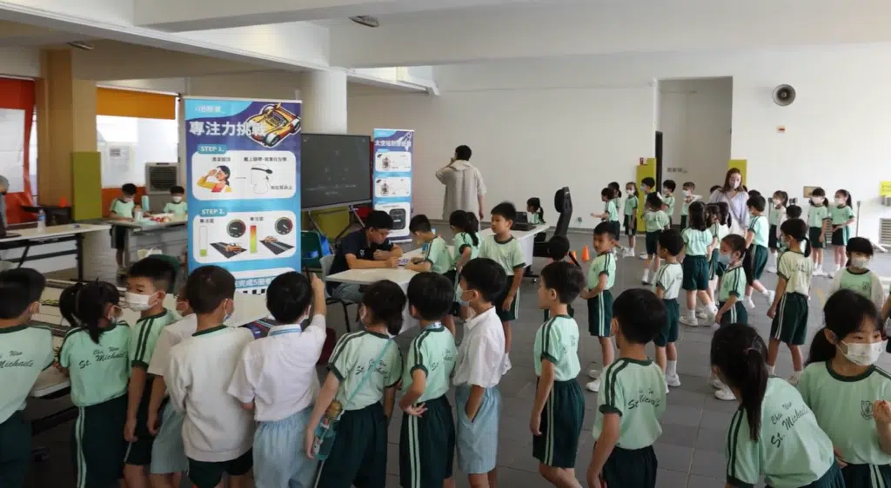
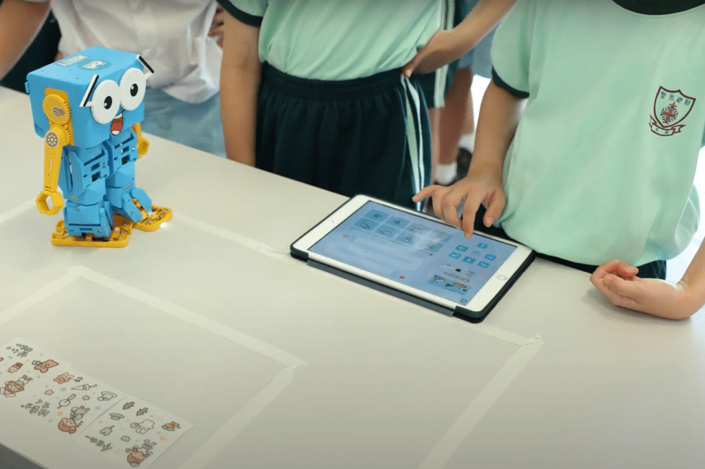
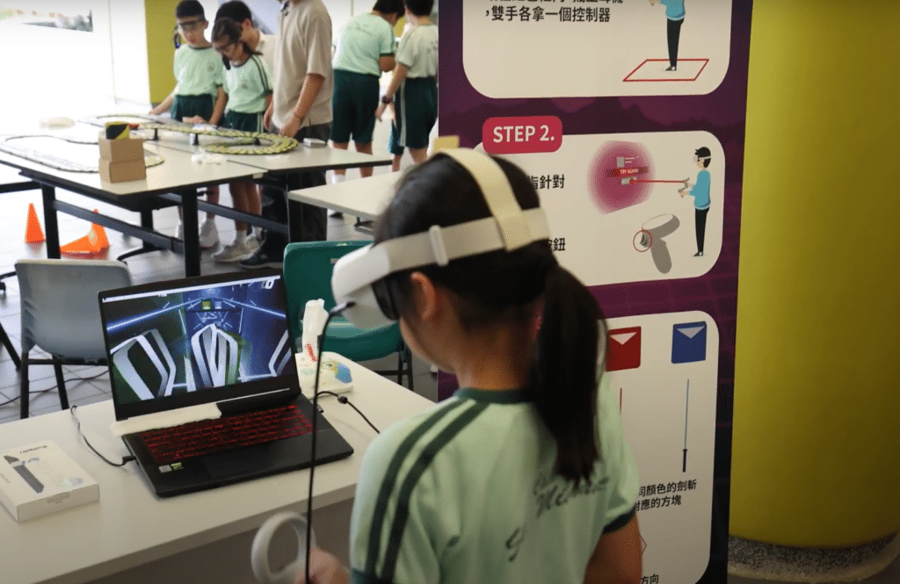
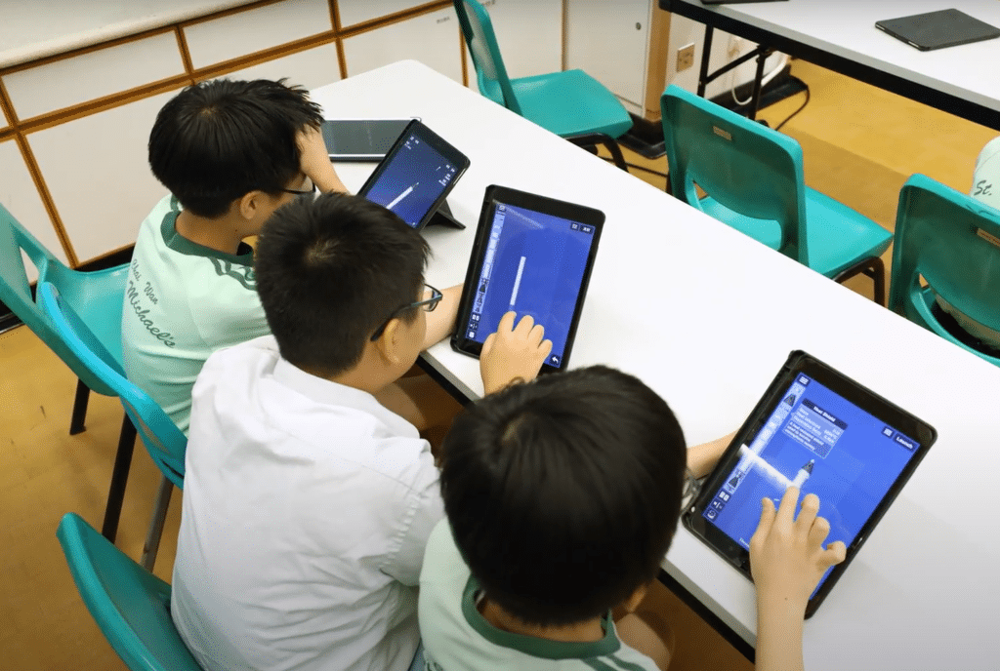

在這次STEM Day活動中，[聖公會柴灣聖米迦勒小學](https://www.skhcwsms.edu.hk/)全校小一至小六學生參與了多樣化的人工智能和編程活動。整個活動設有多個攤位遊戲🎮：

Matatalab和Marty機械人編程體驗讓初小學生們接觸編程邏輯；太空探險AR遊戲和虛擬火箭設計讓學生們透過簡單的遊戲感受宇宙的奧秘🌌🚀；Codrone無人機和念力賽車則激發了他們對科技的熱愛；VR遊戲和電路接駁測試更是讓學生們在趣味中學習技術應用。每個攤位都設計了小任務，鼓勵學生動手操作和解決問題。學生們更能夠回顧數學及常識科上學習到的科學原理，在實踐中鞏固所學知識，可謂一舉兩得🎯

###
