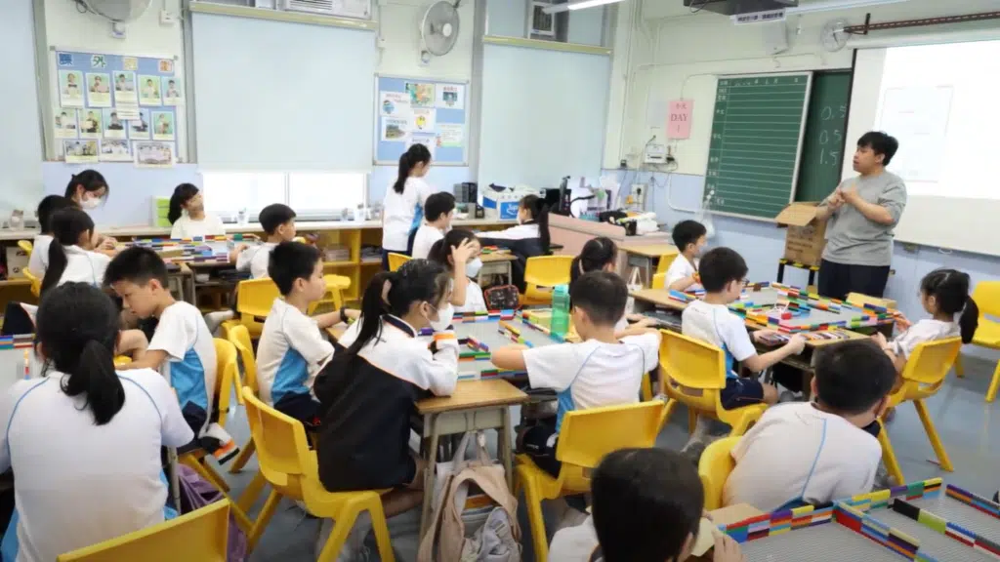
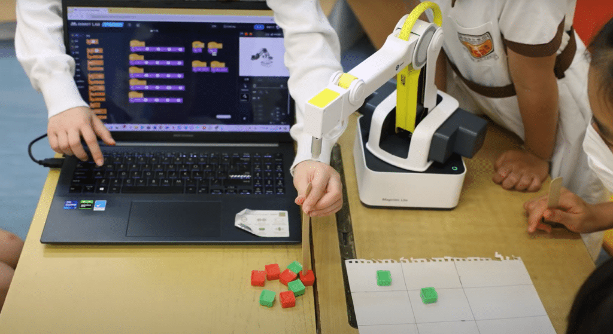
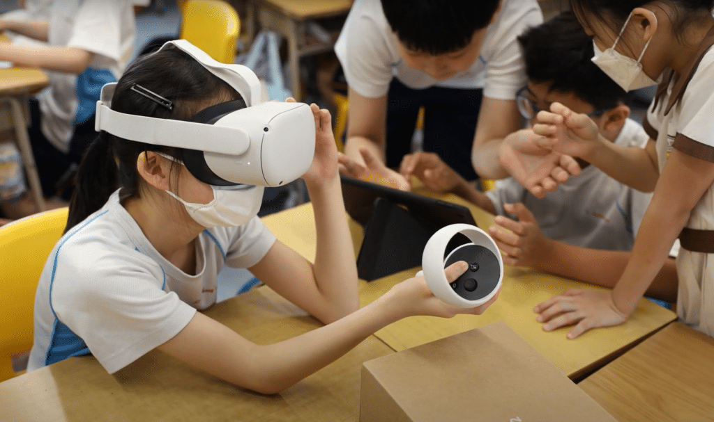
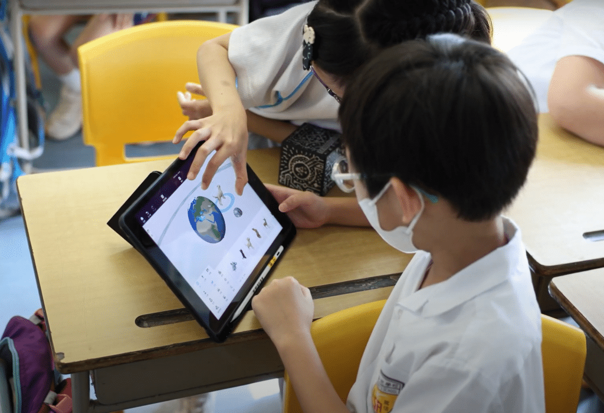
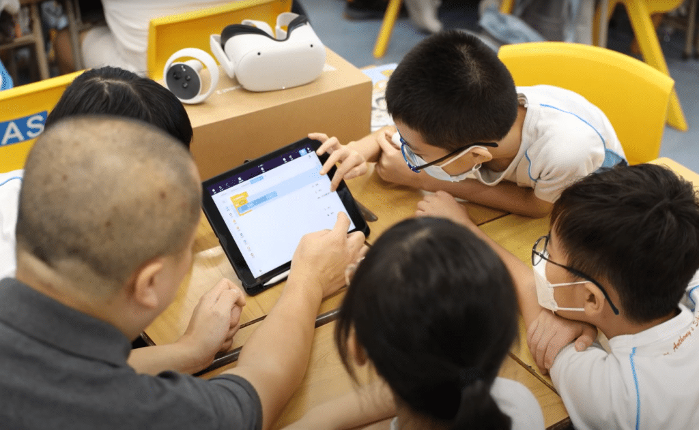
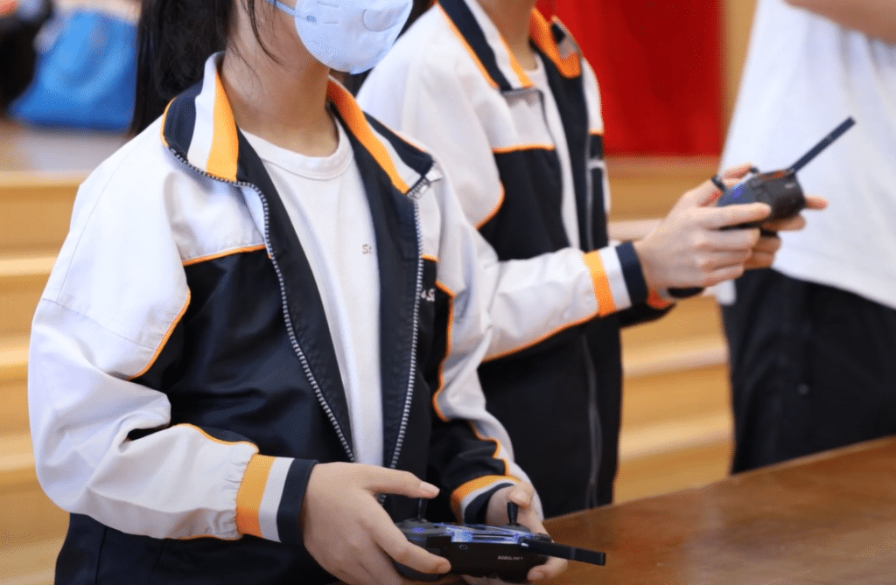

10教育為[聖安多尼學校](https://www.stanthonys.edu.hk/)全校小一至小六共500多名學生帶來了豐富的STEM Day活動。學生們近距離接觸科技創新，動手參與各種精彩的STEM體驗項目，包括Matatalab編程體驗、Dobot智能機械手臂、Delightex VR及AR體驗、Codrone無人機以及Micro:bit遙控車等。

此次活動特別注重促進跨學科學習📚💻，學生們在參與各項活動時，不僅學習了編程、機械操作和虛擬現實技術，還結合數學及科學知識。Matatalab編程體驗讓學生們初步接觸編程；Dobot智能機械手臂則展示了機械工程的應用；Delightex VR及AR體驗則讓學生們感受到虛擬和擴增實境的魅力；Codrone無人機和Micro:bit遙控車更是讓學生們體驗到了現代科技的實際應用🔧這次STEM Day活動不僅讓學生們大開眼界，更促進了他們的跨學科學習和綜合素質的提升📈

###
