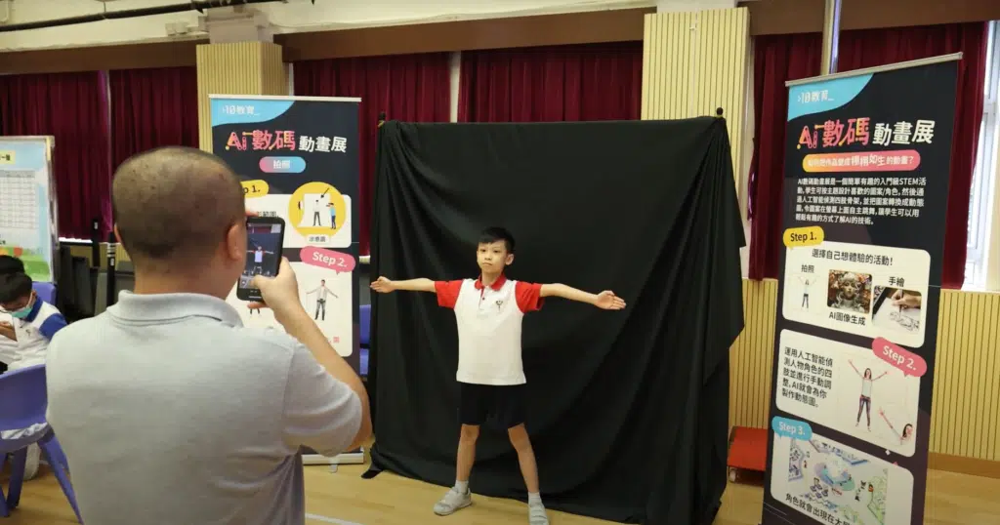

第二年來到中華基督教會基華小學 (九龍塘) ，10教育與全校小四及小五共約200名學生進行了STEM Day活動。學生們近距離接觸科技創新，動手參與各種精彩的STEM體驗項目，包括AI數碼動畫展、科學小手作及Micro:bit降落傘班際比賽🪂

小四、小五兩級學生在學校禮堂分組進行活動，不僅學習了AI技術，還體驗了動手製作及科技競賽的樂趣。其中同學最期待的一定是Micro:bit降落傘班際比賽。同學們首先學習降落傘的相關知識，透過填寫活動學習歷程冊，學生設計及製作自己的降落傘並進行多次測試與調整📊，編程Microbit令到Microbit能夠記錄每次降落的數據，並分析降落速度與降落傘設計之間的關係。此增強了學生對物理原理的理解，競賽提升了團隊合作與解決問題的能力🤝

此次STEM Day活動的成功舉辦，也再次證明了學校與10教育合作的良好成果，期待未來有更多的合作機會，為學生們提供更多元化的STEM活動，增強學生們的科技素養，為未來的科技學習和職業發展做好準備💪

###