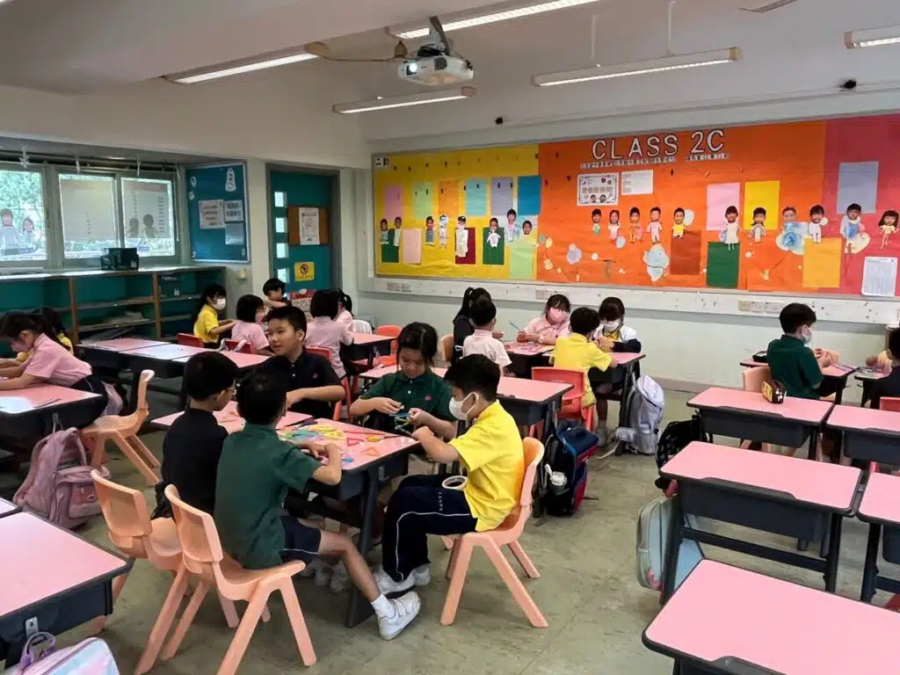

在這次STEM Day活動中，[基督教粉嶺神召會小學](https://www.fagps.edu.hk/)全校超過600名學生參與了以航天為主題的各種豐富多彩的STEM體驗項目🚀🌌學生們參加了航天講座、科學小手作及比賽、虛擬火箭設計、Micro:bit降落傘和Codrone無人機等活動。

今年是學校第二年與[10教育](/)合作舉辦STEM Day活動。為了讓學生們有全新的體驗和接觸更廣泛的STEM活動，今年的主題定為「航天科技」🌠。其中活動的亮點之一是講座由前NASA工程師Billy擔任講者，與學生們分享自己的心路歷程和在航天領域的經驗，激發了學生們對航天科技的濃厚興趣。在各項科學小手作、虛擬火箭設計和Micro:bit降落傘活動中，學生們學習了火箭的設計原理和降落傘的物理特性，親自動手設計和測試，並進行激烈的班際比賽🔥期望下一年能夠再度合作，為同學們帶來更新鮮有趣的體驗。
