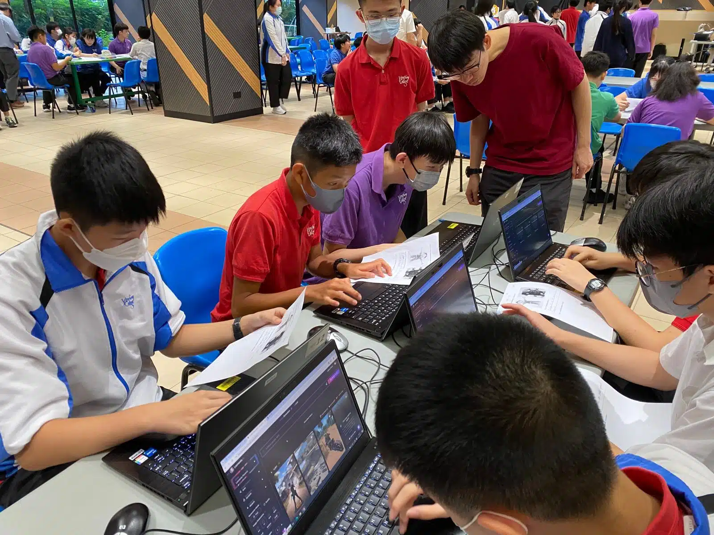

[中華基督教會燕京書院](https://www.yenching.edu.hk/) 全級百多名中二學生於試後活動期間參與了AI數碼動畫展，學生們通過AI技術創作了獨一無二的動畫角色，並在學校的LED Wall上展示，讓角色在屏幕上栩栩如生地跳舞🕺💃

這次活動特點在於讓學生們以三種不同方式製作獨特的角色：AI圖像生成🤖、繪畫🎨及拍照📸。在活動之前，同學們均表示對AI圖像生成最為陌生，但經過這次工作坊後，學生們有了動手操作的機會，親身體驗並利用AI最新技術完成作品。AI圖像生成體驗區讓學生們通過前沿科技創作圖像；沉浸式創意手繪站則讓他們發揮創意，自由繪畫；打卡互動區讓學生們拍攝個人照片，創作獨特角色，並與作品合影留念✨

在創意無限且充滿歡笑的氛圍中，同學們積極參與，享受創作的樂趣。[10教育](/)期待未來能與更多學校合作，共同探索AI數碼動畫的奇妙世界🌍
