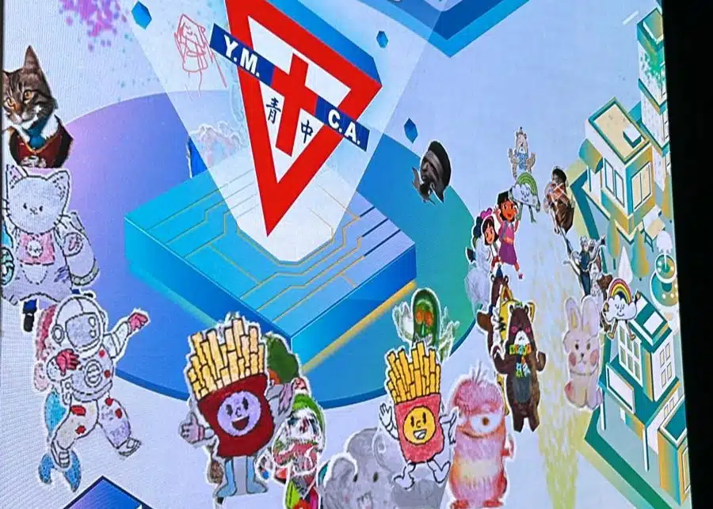

中華基督教青年會中學中一及中二共約350名的學生，在7月5日的STEM Day活動中有機會接觸到AI最新技術，包括時下熱話Donkey Car無人車及AI數碼動畫展。

在Donkey Car無人車講座及體驗中，學生們深入了解人工智能與無人車的最新發展，並應用所學的基本操控技術，進行實際操作，確切了解到無人駕駛汽車的難度和挑戰。除此之外，作為今年校際AI藝術創作大賽的優勝學校，青年會中學的同學在AI數碼動畫展中運用了精湛的AI圖像生成技術創作動畫角色，並在學校的LED Wall上展示，讓角色在屏幕上栩栩如生地跳舞。這些活動都激發了他們在活用人工智能方面的潛能，提升他們對科技與藝術融合的興趣🎨💡