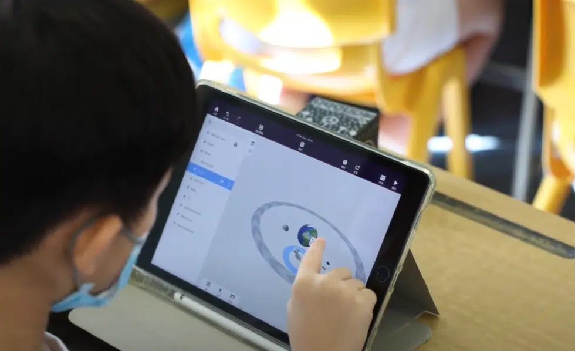

浸信會天虹小學 小四及小五共約200名學生在數次STEM Day中近距離接觸科技創新，參與了Cospaces AR及VR課程，並體驗了多樣的虛擬和擴增實境技術🌐

此次課程橫跨試後活動的數星期，學生們能夠深入學習和研究Cospaces技術之餘，更有充足時間完成課後習作及反思✏️📚 在課堂中，學生們不僅體驗了VR頭戴設備的魅力，還通過AR MergeCube進行了編程，實際操作中學習了虛擬和擴增實境的基本原理。這樣的持續性學習安排，讓學生們有更多的時間掌握技術細節，並進一步鞏固所學知識📐🔍