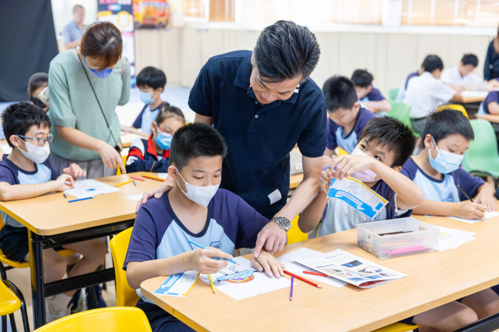

隨著期終考的結束，一連串精彩的試後活動隨之展開。在眾多活動之中，AI數碼動畫展可謂最容易入手，而且是可以同時容納最多學生參與的AI活動之一🎉

🏫在試後活動月期間，[10教育](/)走訪了多間學校，成功舉辦了AI數碼動畫展，包括：

[三水同鄉會劉本章學校](https://www.lpc.edu.hk/)、[香港浸信會聯會小學](https://www.hkbcps.edu.hk/)、[勵志會梁李秀娛紀念小學](https://www.llsy.edu.hk/)、[中華基督教會基華小學](https://www.kwpskt.edu.hk/) (九龍塘)、[中華基督教會燕京書院](https://www.yenching.edu.hk/)、[中華基督教青年會中學](https://www.cymcass.edu.hk/)。 （排名不分先後）

AI數碼動畫展能夠根據各校學年的主題或關注事項設計多樣化主題，讓學生們按照主題創作他們喜愛的圖案或角色🎨。在活動中，學生須以三種不同方式參與創作，再經由AI技術轉換成栩栩如生的動畫，並在學校的LED Wall上展示，讓角色跳舞💃。

活動設有三個體驗區：

AI圖像生成體驗區：學生通過AI技術生成圖像，體驗前沿科技🤖。 沉浸式創意手繪站：學生親手繪畫，發揮創意🎨。 打卡互動區：學生拍攝個人照片，創作獨特角色，並與作品合影留念📸。

這次的AI數碼動畫展為學生們帶來了豐富的學習體驗，師生們在創意無限且充滿歡笑的氛圍中積極參與。10教育期待未來能與更多學校合作，共同探索AI數碼動畫的奇妙世界🌟。

