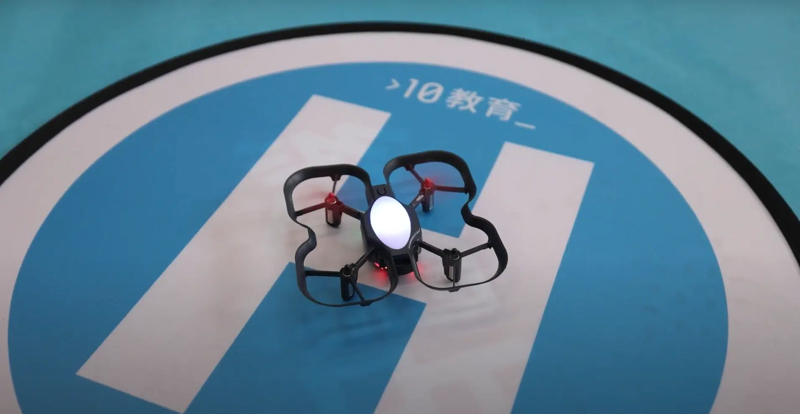

近日，由美國公司 Robolink 耗時6年研發的一款全新的無人機 CoDrone EDU 正式在香港亮相✨經過一番測試後，我地都迫不及待，於五、六月分別舉辦左兩場CoDrone試玩會，率先比中學同埋小學既老師體驗。

咁究竟呢款CoDrone無人機有乜咁特別，值得我地推廣比同學仔？

1. 簡單配對、信號穩定

玩無人機既時候，最令人煩躁既係乜野?當然係連極都連唔到部機啦!有老師係試玩會同我地分享，以前在學校上堂，有好多既時間都係花係接駁Wifi上面，搞到成日都唔夠時間教編程。今次試玩會，老師親自體驗CoDrone容易接駁，只要開著遙控器同無人機，見到兩邊既LED燈顯示同一顏色，就可以起飛啦!而且，仲唔需要駁Wifi，成件事順暢好多!

2. 安全、耐用、容易修理

如果問老師，學校最緊張係乜?相信安全一定係排頭位。CoDrone 機身只有57克重，比市面上的某品牌無人機，輕近接近40%。而且輕型無人機即使發生碰撞，造成重大傷害或損壞的可能性較小，因此在有孩子的學校環境中使用更為安全。此外，輕型無人機通常更容易控制，適合初學者和年輕學生，降低了事故發生的風險。CoDrone還特別設計了一個安全機制，當無人機偵測到強烈撞擊時，馬達會自動關閉，確保學生們的安全不受威脅。

CoDrone無人機主要通過編程進行精準控制飛行路徑，並擁有自動避障功能，為同學們既飛行安全提供保障。相比其他市面上既某些無人機只具有視覺定位系統，CoDrone無人機仲設有顏色感應器同距離感測器等唔同功能。

3. 多功能編程體驗

學生們喺課程中利用Blockly/Python編程工具操控無人機，搭配不同的傳感器，例如:色彩感測器能夠偵測並區分不同顏色。前方測距感測器，氣壓計和底部測距（高度）感測器，配合可編程LED及揚聲器，CoDrone就可以參與各種有趣既飛行任務，如空中障礙賽，空中音樂協奏，空中測量師等，又或者自行探索，創作自己既花式表演，從而訓練佢地既創意同解難能力。

4. 到校課程經驗

短短兩個月間，我地已經將CoDrone EDU帶到香港不同學校，開展無人機課程及STEM Day活動，其中包括[香港浸信會聯會小學](https://www.hkbcps.edu.hk/)、[聖公會柴灣聖米迦勒小學](https://www.skhcwsms.edu.hk/)、[聖安多尼學校](https://www.stanthonys.edu.hk/)、[基督教粉嶺神召會小學](https://www.fagps.edu.hk/)、[保良局何蔭棠中學](https://www.plkhtyc.edu.hk/)、[保良局胡忠中學](https://www.plkwcc.edu.hk/)、[寶血會嘉靈學校](https://www.kalingpb.edu.hk/)、[中華基督教會望覺堂啟愛學校](https://www.wkts.edu.hk/)等。

想知道更多關於CoDrone EDU 的資訊或者課程內容，歡迎致電/whatsapp 6554 1506。
