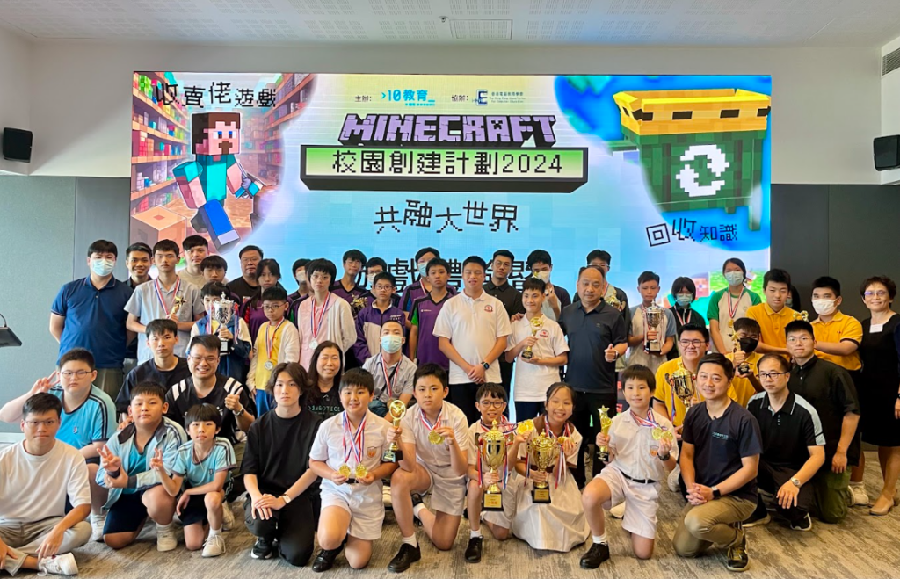

轉眼間新學年又開始啦！回顧過去半年的「Minecraft 校園創建計劃 2024」，我們以共融大世界為主題，邀請香港的非主流學生與主流學生一同體驗在Minecraft世界創建的樂趣。學生們於下學期參加了十多小時既Minecraft課程，學習建設自己的校園及遊戲設計，非主流和主流學校更會一起上課為對方的作品交流意見和心得。最後，幾個月的學習旅程以剛過去的星期日 (8月25日) 舉行之遊戲體驗及成果發佈會作結。

當天早上首先進行遊戲體驗環節，四間主流學校隊伍需向大家展示遊戲設計成果並帶領非主流學生試玩他們的遊戲。而在下午時段，主流學校就早前設計的遊戲進行匯報和分享，亦會展示八間學校隊伍創建校舍的介紹片段，作品還原度極高，令人驚嘆。他們不僅在虛擬世界中展現出色的建築技巧，還將自己學校的特色和文化融入到作品中，呈現了獨特多元的創意。

在數個月期間，學生們學會了如何巧用Minecraft進行建築，更培養了團隊合作👥、解決難題🔒和創新思維🧠的能力。是次計劃亦為非主流學生提供了一個實踐和展示自己創意的平台，讓他們在Minecraft世界中展現自己的一技之長，並促進主流和非主流學生之間的互動，締造共融學習之旅！

想知道更多關於Minecraft比賽的資訊或者課程內容，歡迎致電/whatsapp 6554 1506。
