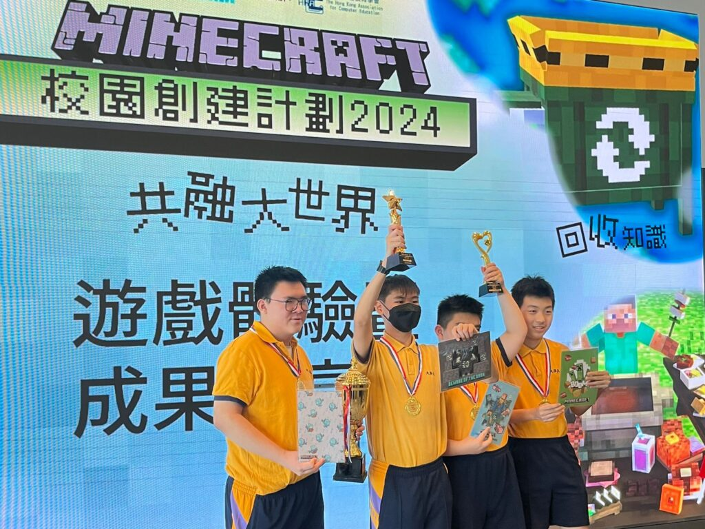

## 參與「Minecraft 校園創建計劃2024」比賽日有感
本校同學於本學年參加了由「10教育」舉辦的「Minecraft校園創建計劃2024 —— 共融大世界」活動。經過了三個月的學習和實踐，同學們終於在群策群力之下，創建了第一所「Minecraft校園」。當中同學們經歷過探索、嘗試和失敗，但在「「10教育」導師 Beefung 的循循善誘之下，同學們拼發出驚人的耐力和創造力，用科技創建了屬於他們的虛擬校園，使人擊節讚賞！

最後，我們的同學在比賽日中更奪得「校園創建一等獎」及「積極投入獎」。其中，本校鍾嘉俊同學更獲得「傑出學生獎」，實在可喜可賀！

同學們在比賽日當日，真可謂樂在其中，全情投入各個攤位遊戲活動；可能正正因為他們無比投入，發出的聲浪也是全場之冠，所以獲得了評判的青睞，獲頒「最積極投入獎」，這對同學們而言，都是極大的肯定和鼓勵！

再次多謝「10教育」的安排，為主流、非主流學生們，開闢了一扇共融之窗，讓大家能一起邁步「共融大世界」！

 天保民學校陳校長
