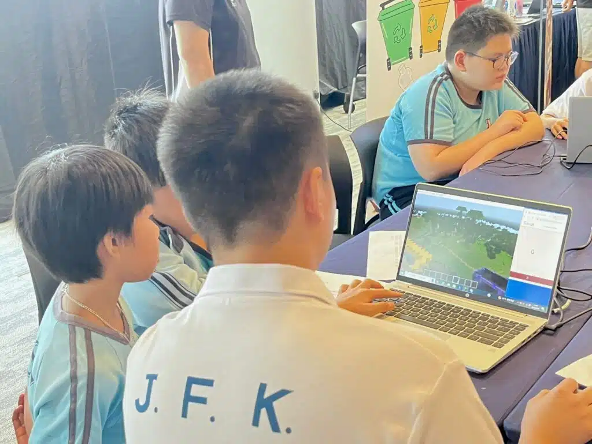

 參與 Minecraft 校園創建計劃，是一次難得的體驗。我校學生與[聖安多尼學校](https://www.stanthonys.edu.hk/)的同學攜手，在比賽中展現出極佳的合作精神。利用 Minecraft 設計虛擬校園的過程充滿挑戰，卻也充滿樂趣。獲得最佳跨校合作獎，證明了特殊學校的孩子同樣能在合作中綻放光彩。感謝[聖安多尼學校](https://www.stanthonys.edu.hk/)的支持，也為我校學生的努力與成長感到驕傲。

馮耀宗老師([香港紅十字會甘迺迪中心](https://www.hkrcjckc.edu.hk/))
