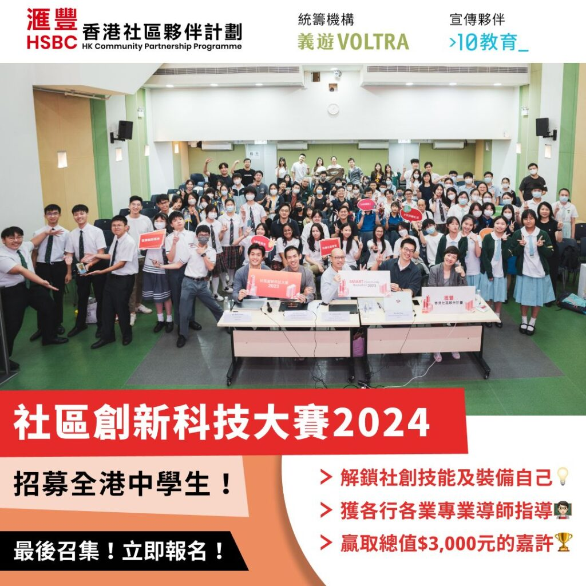

今年，[10教育](/)有幸可以成為「匯豐香港社區夥伴計劃」之其中一個項目 - 社區創新科技大賽 Hackathon 2024 之宣傳夥伴🎊

本次比賽支持學校以社會創新幫助弱勢社群、推動綠色思維及可持續生活，凝聚各界共建共融和諧的節約型社會。獲勝隊伍可獲全方位支援，繼續發展項目。

有興趣參加之學校，可以參考活動官網：https://www.voltra.org/smart-community-hackathon-2024?utm_source=website&amp;utm_medium=banner&amp;utm_campaign=voltra
