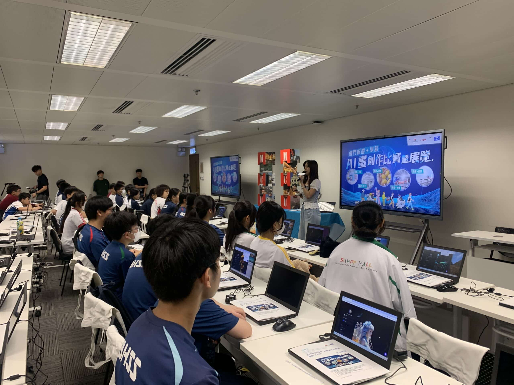

過去兩年，10教育積極推動AI藝術創作在香港中小學的發展，舉辦了兩屆校際AI藝術創作大賽，並在J.P. Morgan及香港生產力促進局等機構舉行了數場AI繪圖工作坊。最近，我們更進一步，將AI藝術創作的熱情帶出香港！

在香港01和澳門旅遊局的合作下，我們為125名香港中學生舉辦了「澳門旅遊+學習」AI畫創作工作坊🇲🇴。學生們須以澳門旅遊元素為主題進行創作及進行比賽，並將在後續的得獎作品展覽中展出他們的精彩作品🖼️透過這次活動，學生們在正式考察前學習了如何以AI技術創作畫面，為他們的澳門之行增添了全新的創作體驗。🌟

相關資訊：

澳門「旅遊+」AI畫創作工作坊完滿結束 中學生以科技重新感受澳門 | 香港01 https://www.hk01.com/article/1066401?utm_source=01articlecopy&amp;utm_medium=referral

澳門旅遊+學習活動正式展開！10月5日逾百學生學AI繪澳門美景 | 香港01 https://www.hk01.com/article/1062881?utm_source=01articlecopy&amp;utm_medium=referral