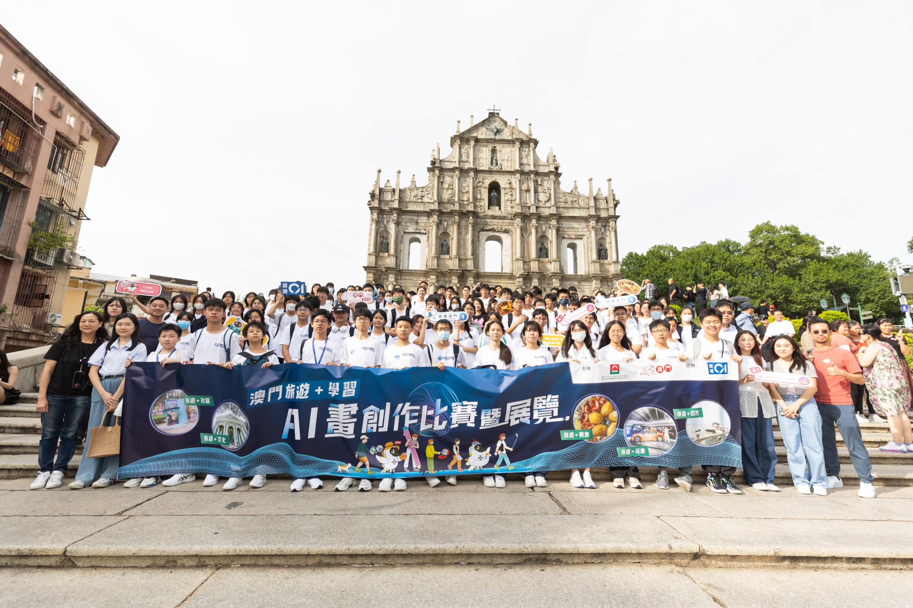

繼主持AI畫創作工作坊後，10教育早前聯同澳門旅遊局及香港01，帶領逾百名香港中學生參與澳門考察日，探索自然🌿、文化🎭、歷史🏛️、美食🍴及社區🏘️五大主題，透過實地體驗加深對澳門的認識。

活動充分體現了我們在推廣AI藝術創作方面的實力與豐富經驗🌟我們於活動期間為學生提供全方位支持，指導他們運用工作坊所學之AI繪圖技巧，將旅途中所見所聞轉化為創意十足的數碼藝術作品🖼️，生動呈現澳門的多元風貌，並完美體現創意與科技的融合👏。

活動即將進入尾聲，壓軸環節之頒獎禮將於本週六（23日）在啟德Airside舉行，屆時將公布得獎者🏆，並同步於週末期間（23日及24日）舉行得獎作品展覽，展出學生的得獎作品，讓公眾一同見證學生們的學習成果🎉

相關資訊：

澳門「旅遊+」考察　自然、文化/歷史、社區、玩樂、美食新體驗 | 香港01 https://www.hk01.com/article/1073178?utm_source=01articlecopy&amp;utm_medium=referral