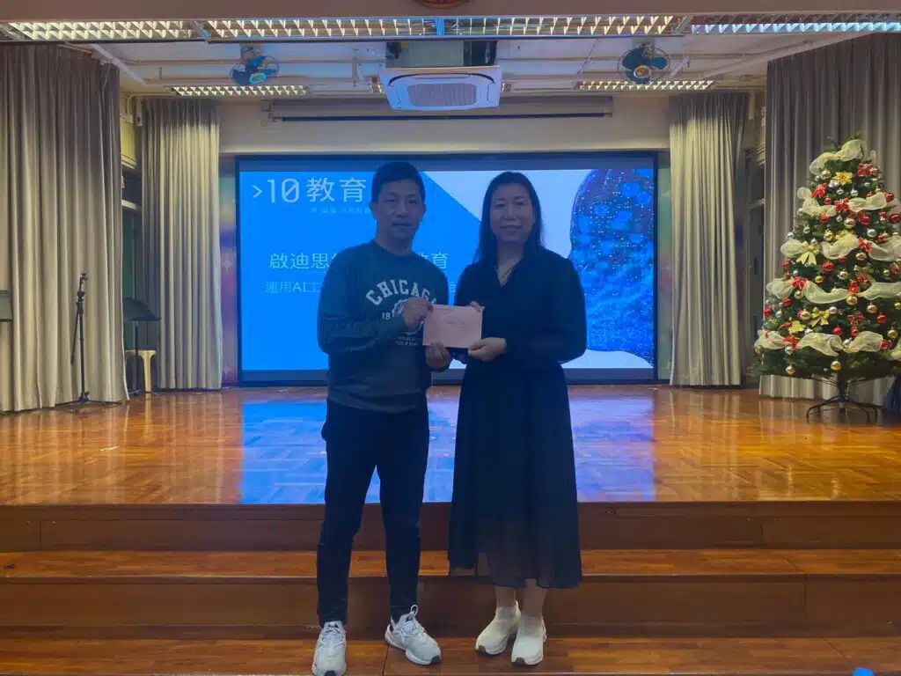

講者Jenny Li 與浸信會呂明才小學王副校長合照

家長講座實用人工智能技巧——幫助孩子學習、教育孩子掌握AI素養

近日，10教育機構到訪浸信會呂明才小學，舉辦了一場「如何利用AI提升子女的學習效能」，講座內容包括實用人工智能技巧，幫助孩子學習，教育孩子掌握AI素養。活動吸引了大批家長參與，講座內容深入探討了AI如何在教育和生活中幫助孩子提升學習效能，並分享了AI素養的重要性。

#### 講座內容回顧

講座由10教育機構的Jenny Li主講，圍繞以下四大重點展開：

1. 人工智能的基本概念向家長介紹AI技術的運作方式及其日常應用，如語音助手、人面辨識等，幫助家長掌握AI的知識。
2. 如何利用AI提升子女的學習效能展示如何使用AI工具進行個性化學習，減輕家長的監督壓力。
3. AI如何改變未來生活分享AI技術在自動駕駛、低空經濟等領域的實際應用，幫助家長了解未來智能化世界對孩子的影響。
4. AI素養的重要性強調培養孩子理解AI基本原理及應用的能力，幫助他們適應未來趨勢，並提供具體實用的教育建議。

#### 家長反饋

活動結束後，我們收集了家長的意見。大部分家長對講座表示「非常滿意」，認為內容實用且具啟發性。不少家長提到希望參加更多類似活動，並建議加入更多AI實際應用的案例來豐富內容。這顯示了家長對AI教育的高度關注及期待。

#### 推動AI教育的下一步

我們致力於推廣STEAM教育，將持續與更多學校合作，為家長和孩子帶來更多實用的AI課程和活動。如果您有興趣安排講座，或想了解更多關於我們的服務，歡迎點擊以下連結與我們聯繫！我們期待與您攜手，推動孩子的未來教育發展。