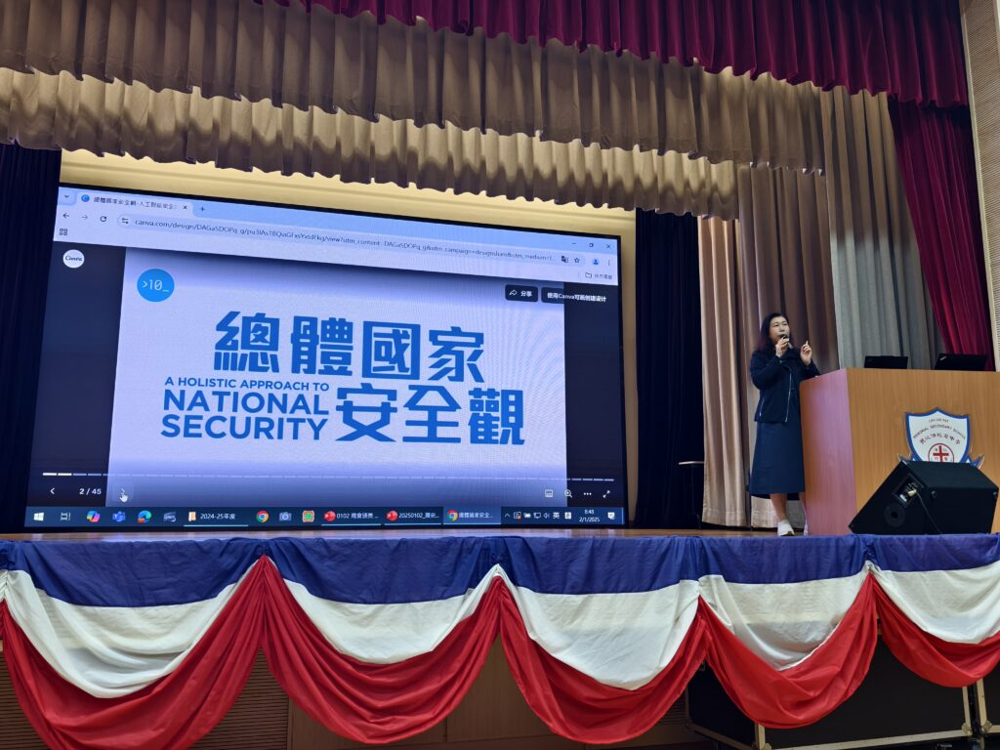
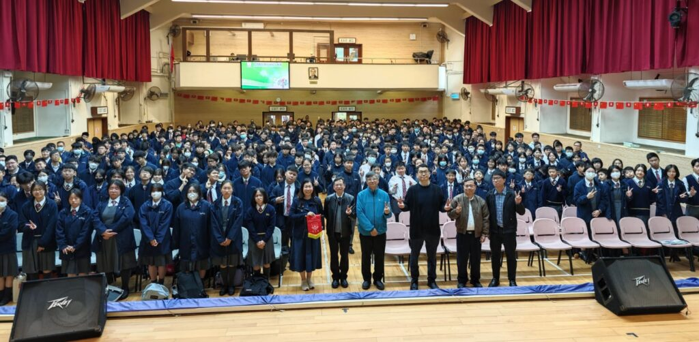
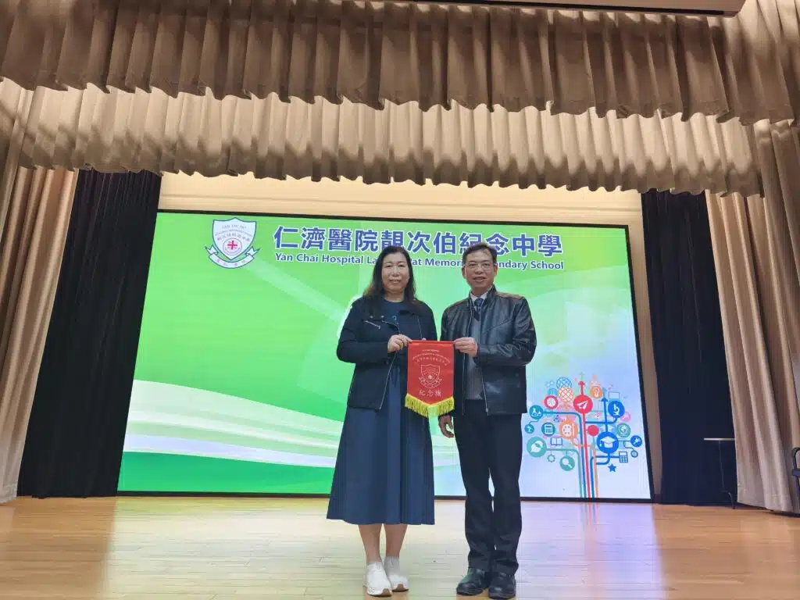

講者Jenny Li 為國家安全教育地區導師

《國家安全20個範疇中的人工智能安全》講座——探索AI技術應用與安全風險

2025年1月2日，10教育機構的Jenny Li在[仁濟醫院靚次伯紀念中學](https://www.lcp.edu.hk/)為全校師生舉辦了一場以《國家安全20個範疇中的人工智能安全》為主題的講座。作為剛完成「國家安全教育地區導師培訓計劃」的導師，講者結合培訓所學，向同學們介紹了人工智能技術在生活中的實際應用，剖析了可能帶來的數據安全、網絡攻擊、經濟風險等挑戰，並強調了正確應對和風險防範的重要性。此外，講者也分享了法律法規與道德框架在維護人工智能安全中的關鍵角色，鼓勵同學們在學習和生活中增強國家安全意識，成為具備數碼素養與安全責任感的未來公民。希望透過這場講座，能為學校和學生帶來有價值的學習體驗，共同推動國家安全教育的普及與深化。

#### 推動AI教育的下一步

我們致力於推廣STEAM教育，將持續與更多學校合作，為學生帶來更多實用的AI課程和活動。如果您有興趣安排講座，或想了解更多關於我們的服務，歡迎點擊以下連結與我們聯繫！

