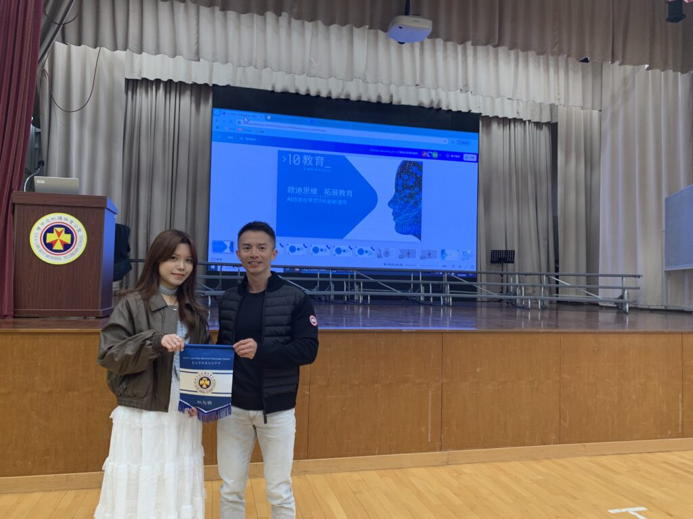

**10教育講者Suki與聖公會林護紀念中學於教師工作坊 | 如何利用 AI 提升教學效率？講座前的合影**

《如何利用 AI 提升教學效率？讓科技助力教師與學生共成長》講座——聖公會林護紀念中學教師工作坊回顧

在當今教育環境中，人工智能（AI）已逐漸改變教師的工作方式與學生的學習模式。然而，許多學校面臨一個共同的問題——部分教師已熟練運用 AI 來提升教學效率，而部分教師仍對 AI 技術保持觀望，擔心學生濫用 AI 會影響學習成果。

為了解決這個問題，本次講座採用了雙軌工作坊模式，讓教師可以根據自身的 AI 技能選擇適合的學習內容，確保每位參與者都能獲得最大化的學習效益。

雙軌 AI 工作坊：為不同程度的教師量身打造本次活動特別設計了兩種學習路徑，幫助教師從基礎到進階全面掌握 AI 工具

雙軌 AI 工作坊：為不同程度的教師量身打造

本次活動特別設計了兩種學習路徑，幫助教師從基礎到進階全面掌握 AI 工具：

1. AI 入門工作坊（適合初學者）

- Poe AI 平台介紹：了解 AI Bot 的種類與應用場景
- 如何利用 MagicSchool AI 生成教材與測驗，幫助教師快速建立課堂內容
- AI 圖片生成體驗：探索 AI 在教學與創意設計中的應用

2. AI 進階應用工作坊（適合有經驗的教師）

- 自定義 AI Bot：設計個人化 AI 教學助手，提高課堂互動性
- 結合文件與知識庫：上傳 PDF、設計 AI 輔助的課程計劃
- 跨 AI 平台應用比較：測試不同 AI 模型，找出最適合教學的解決方案
- 提升教師行政與教學效率：運用 AI 來減少重複性工作，把時間留給學生關懷與個別指導
- 利用Gamma AI 自動生成教學PPT

這種分級學習方式確保每位教師都能以最適合自己的節奏學習 AI，無論是剛接觸 AI 還是希望進一步深化 AI 技能的教師，都能獲得最佳學習體驗。

#### 為何教師應該學習 AI？

本次講座強調了一個核心觀點：AI 是未來趨勢，教師應該擁抱它，而非排斥它。我們提出了三個關鍵原因：

1. AI 已成為教育趨勢，無法迴避
- AI 影響著課程設計、學生學習方式及教育評估，教師若不掌握 AI，將無法應對未來的教學變革。
2. 學生已經在使用 AI，教師需要理解並正確引導
- 若教師不了解 AI，將難以判斷學生是否盲目抄襲 AI 內容，甚至無法培養學生正確使用 AI 的能力。
3. 運用 AI 可以減少教師的行政負擔
- AI 可自動生成課程計劃、測驗與學習資源，讓教師有更多時間專注於課堂互動、學生關懷與個性化教學。

這些關鍵觀點獲得了與會教師的高度共鳴，許多教師在活動後表示，這場講座讓他們對 AI 的應用有了更清晰的認識，也更有信心運用 AI 來提升教學效率。

擁抱 AI，讓教學更智慧

本次 AI 講座與雙軌工作坊的成功舉辦，讓許多教師重新思考 AI 在教育中的價值。與會者普遍認為，正確使用 AI 不僅能優化教師的工作方式，也能幫助學生培養獨立思考與創造力，而不是簡單依賴 AI 生成內容。

10教育將持續推動 AI 在教育領域的應用，並計劃在未來舉辦更多針對不同需求的 AI 進階培訓。如果您的學校對 AI 教育應用有興趣，歡迎與我們聯繫，共同探索 AI 如何改變未來的教與學！