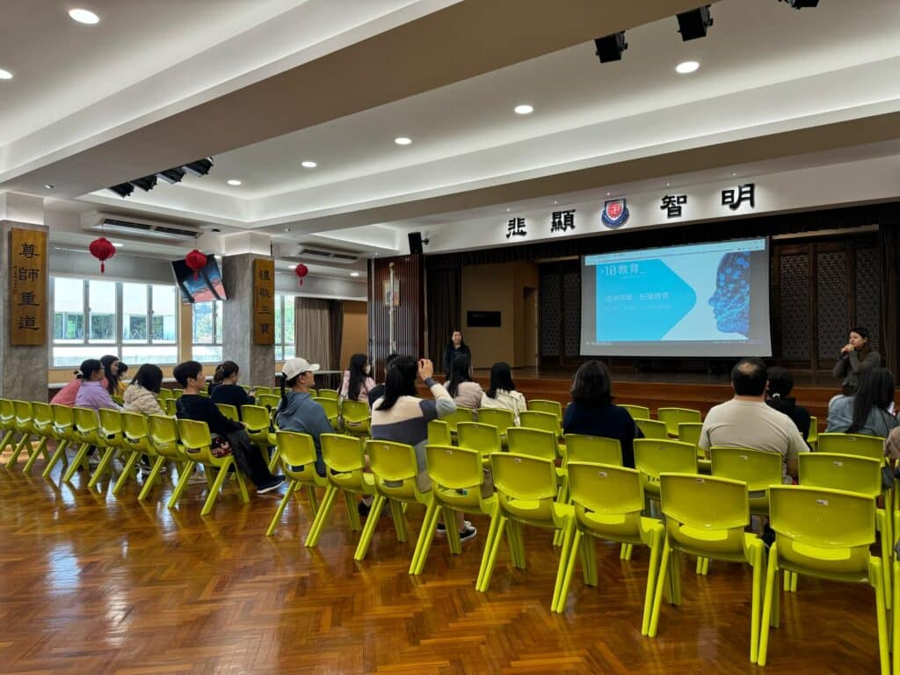

## 如何利用AI提升子女的學習效能——DeepSeek、HaiLuo、CoPilot 的實際應用與安全指南

**10教育講師Jenny Li在慈航學校講座中，講解如何利用DeepSeek、HaiLuo、CoPilot提升學習效能，並分享AI安全使用指南。**

如何利用AI提升子女的學習效能——DeepSeek、HaiLuo、CoPilot 的實際應用

2025年3月20日，10教育的講師Jenny Li在慈航學校舉辦了一場以「如何利用AI提升子女的學習效能」為主題的講座。本次活動不僅深入探討了AI技術在教育學習中的應用，還實際演示了多款AI工具，包括 DeepSeek、HaiLuo 和 CoPilot，讓家長親身體驗這些工具如何幫助孩子提升學習效率。

AI工具演示：DeepSeek、HaiLuo、Copilot 的實際應用

在講座中，我們展示了以下三款AI工具的實際應用：

- DeepSeek：幫助學生快速搜索學習資源，提升學習效率。
- HaiLuo：利用人工智能生成將文本或圖像轉成視頻，直觀感受AI的功能。
- CoPilot：直接通過 WhatsApp 與 Microsoft Copilot 互動，無需 VPN 或安裝額外的 App 即可直接使用。

這些演示讓家長直觀地感受到AI工具如何融入孩子的日常學習，並為他們提供實用的學習支持。

AI安全使用指南：如何引導孩子正確使用AI

除了展示AI工具的優勢，我們還特別強調了AI技術的安全使用。講座中，我們分享了以下重點：

- 數據隱私保護
- 內容篩選與監管

這些內容幫助家長更好地理解如何在日常生活中引導孩子安全、有效地使用AI技術。

家長反饋：講座成效與未來期望

根據家長的問卷反饋，本次講座獲得了高度評價：

- 理解提升：大多數家長表示，講座讓他們對AI技術的應用有了更深入的認識。
- 內容實用性：家長們普遍認為講座的內容非常實用，能夠幫助他們更好地支持孩子的學習。
- 未來期望：許多家長希望學校能舉辦更多此類講座，以進一步了解AI技術在教育中的應用。

這些反饋顯示，講座不僅提升了家長對AI技術的理解，也為他們提供了實際的工具和建議，幫助他們更好地引導孩子的學習。

10教育將持續推動 AI 在教育領域的應用，並計劃在未來舉辦更多針對不同需求的 AI 進階培訓。如果您的學校對 AI 教育應用有興趣，歡迎與我們聯繫，共同探索 AI 如何改變未來的教與學！